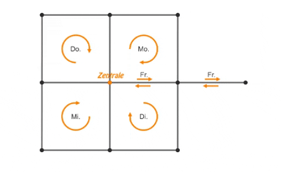

# Müllabfuhr

❔ A1 👤 61015 🧑 Leonhard Masche 📆 10.04.2022

## Inhaltsverzeichnis

1. [Lösungsidee](#lösungsidee)
    1. [Verbesserungen](#verbesserungen)
    2. [Aufbau](#aufbau)
2. [Umsetzung](#umsetzung)
3. [Beispiele](#beispiele)
4. [Quellcode](#quellcode)

## Lösungsidee

Zuerst wird das Straßennetz in einer Adjacency-List Datenstruktur gespeichert. Nun wird von der Basis (Vertex 0) ausgehend ein modifizierter Breadth-First-Search Algorithmus verwendet, um die in Frage kommenden Routen zu erhalten. Der Algorithmus speichert die aktuelle Node zusammen mit dem Pfad der bis dorthin beschritten wurde in `visited`, und zeichnet alle Möglichkeiten von der derzeitigen Node weiterzugehen (rückwärtsgehen ausgeschlossen), zusammen mit der dann entstehenden Länge des Pfades auf. Wenn ein Pfad auf eine Vertex aus dem `visited`-Set trifft, wird der jetzige Pfad mit dem in `visited` gespeicherten Pfad zusammengefügt und als Ergebnis des Algorithmus in der Liste `paths` gespeichert. Wenn alle Straßen vom Algorithmus abgedeckt wurden, ist dieser Schritt fertig.



Da es passieren kann, dass eine Straße ofters als benötigt 'befahren' wird, werden im nächsten Schritt unnötige Wege entfernt.

Nun ist allerdings nicht garantiert, dass `paths` die richtige Länge (z.B. 5 Tage) hat.
Deshalb werden, solange die Länge von `paths` größer als die Anzahl der Tage ist, die beiden kürzesten Pfade kombiniert. Somit wird eine zu lange Liste verkürzt. Ist sie jedoch zu kurz, wird sie mit Nullen (Wagen bleibt in der Zentrale) aufgefüllt.

Soweit bis jetzt. Nach längerem Nachdenken über eine bessere Lösung bin ich auf das `min-max k-Chinese Postman problem` gestoßen. Das Ziel ist es, die Touren von `k` Briefträgern so zu verteilen, dass die längste Tour minimiert wird. Es wurde auch bewiesen dass dieses Problem nicht effizient lösbar ist. Für die Optimierung habe ich den tabu-Suche Algorithmus aus dieser [Arbeit](https://www.sciencedirect.com/science/article/pii/S0305054805000663) implementiert. Kurzgesagt wird iterativ eine 'Nachbarschaft', also leichte Veränderungen zweier Touren durch das Verschieben von zwei Kanten berechnet, und der beste Kandidat, der nicht in der tabu-Liste enthalten ist, wird weiterverbessert. Die tabu-Liste hat eine bestimmte Zeit, für die Elemente als tabu gelten. Diese Zeit hat mit einem Wert von `20` (20 Iterationen) gute Ergebnisse geliefert. Zusätzlich wird die Optimierungsphase durch ein Limit von `100` Iterationen ohne Verbesserung, und eine maximale Laufzeit von `10` Sekunden beschränkt.

### Verbesserungen

#### Nicht-Integer Gewichte

Eine vorgenommene Verbesserung ist das Einlesen von Fließkommazahl-Gewichtungen der Straßen. Es ist unrealistisch dass in einem echten Szenario Straßen eine Länge von z.B. genau 480m haben. Um das zu implementieren wird der dritte Wert aus den Beispieldateien als
<i style="color:orange">float</i>
eingelesen.

#### Home-office

Eine Funktionalität des Verbesserungs-algorithmus, die im Aufsatz nicht beschrieben wurde, ist die Möglichkeit, in der Zentrale zu bleiben. Dies ist der Fall, wenn Pfade nicht mehr sinnvoll verkürzt werden können, und somit das Ausfahren an zusätzlichen Tagen keine Verbesserung bringt. Der ausgegebene Pfad ist dann einfach `0`.

#### Arbiträre Anzahl Tage

Auch kann eine Anzahl an Tagen eingegeben werden, für die geplant werden soll. So kann zum Beipiel ein Fahrplan für zwei Wochen erstellt werden. Dazu werden einfach die merging- und padding-Schritte am Ende der `get_paths` Funktion angepasst. Diese Veränderung and `k` wird auch in der Optimisierungsphase berücksichtigt.

### Aufbau

*utility.py*

**class TabuList**
> Eine tabu-Liste, die Elemente für eine Zeit von `tenure` als tabu markiert.

**def TabuList.\_\_init__(default_tenure: int, cleanup_freq: int = 20)**
> Initialisiert die tabu-Liste mit einer default_tenure.

**def TabuList._cleanup()**
> Interne Methode. Wird aufgerufen, um abgelaufene Einträge aus der Liste zu löschen.

**def TabuList.add(item: Hashable, tenure: int = None)**
> Setzt ein `item` für eine Zeit von `tenure or default_tenure` auf die tabu-Liste.

**def TabuList.get(item: Hashable) -> int**
> Gibt die Zeit zurück, bis `item` nicht mehr tabu ist. (Sonst `0`)

**def TabuList.tick()**
> Inkrementiert die Zeit um eins.

**def remove_by_exp(exp: Callable[[Any], bool], lst: List)**
> Entfernt das erste Element bei dem `exp` 'True' zurückgibt.

<br>

*program.py*

**class CityGraph**
> Klasse die ein Straßennetz (ungerichteter gewichteter Graph) repräsentiert.

**def __init\_\_(vertices: List[int], edges: List[Tuple[int, int, float]])**
> Initialisiert den CityGraph mit einer Liste der Vertices und der adjacency-list.

**@classmethod <br> def _from_bwinf_file(path: str) -> 'CityGraph'**
> Liest eine Beispieldatei ein, und gibt einen CityGraph zurück.

**def _contains_all_edges(paths: Iterable[Iterable[int]]) -> bool**
> Gibt als Wahrheitswert zurück, ob die gegebene Liste an Pfaden alle 'Straßen' im Graph abdeckt.

**def get_paths(days: int = 5) -> List[Tuple[float, Tuple[int, ...]]]**
> Gibt eine Liste zurück, die Tuples mit dem Pfad, und der Länge dessen an erster Stelle, enthält.

<br>

*tabu_optimization.py*

**def MMKCPP_TEE_TabuSearch(G: Dict[int, Dict[int, float]], tours: List[Tuple[int, ...]], maxNOfItsWithoutImprovement: int = 100, maxRunningTime: float = 0, tabuTenure: int = 20) -> List[Tuple[int, ...]]**
> Min-Max K-Chinese Postman Problem - Two Edge Exchange. Optimiert die gegebenen `tours` nach dem beschriebenen Verfahren.
> `G` ist eine adjacency-List in der auch die Gewichte der Kanten gespeichert sind.
> `maxNOfItsWithoutImprovement` ist die Maximalzahl der Iterationen ohne das Finden einer besseren Lösung, dass der Algorithmus abgebrochen wird.
> `maxRunningTime` ist die maximale Laufzeit des Algorithmus, bevor dieser abgebrochen wird.
> `tabuTenure` ist die Anzahl an Iterationen, die ein schon besuchtes Element als tabu markiert wird.

*die folgenden Funktionen befinden sich innerhalb der Funktion MMKCPP_TEE_TabuSearch*

**def edges(tour: Tuple[int, ...]) -> Iterable[set]**
> Gibt alle im Pfad `tour` enthaltenen Kanten in der Form `[{0, 1}, {1, 2}, ...]` zurück.

**def w_tour(tour: Tuple[int, ...]) -> float**
> Gibt die Länge eines Pfades `tour` zurück.

**def w_max_tours(tours: Iterable[Tuple[int, ...]]) -> float**
> Gibt die Länge aller Pfade in `tours` zurück. Dies ist auch die cost-Funktion, die es zu minimieren gilt.

**def edgecount_tour(tour: Tuple[int, ...]) -> collections.Counter**
> Zählt alle Kanten im Pfad `tour`.

**def edgecount_tours(tours: List[Tuple[int, ...]]) -> collections.Counter**
> Zahlt alle Kanten in den Pfaden `tours`.

**def MergeWalkWithTour(tour: Tuple[int, ...], walk: Tuple[int, ...]) -> Tuple[int, ...]**
> Verbindet `walk` (2 Kanten) mit dem jetzigen Pfad `tour`.

**def SeparateWalkFromTour(tour: Tuple[int, ...], walk: Tuple[int, ...]) -> Tuple[int, ...]**
> Entfernt die Kanten `walk` im Pfad `tour`, während aufgepasst wird, dass der Pfad verbunden bleibt.

**def _ReorderToClosedWalk(edgeset: List[set]) -> Tuple[int, ...]**
> Ordnet die Kanten `edges` so, dass ein geschlossener Pfad, der bei Kreuzung 0 anfängt und endet, entsteht.

**def RemoveEvenRedundantEdges(tour: Tuple[int, ...], tours: List[Tuple[int, ...]]) -> Tuple[int, ...]**
> Entfernt Kanten im Pfad `tour`, die zu gerader Zahl vorkommen, immernoch in anderen Touren vorkommen, und den Pfad verbunden lassen.

## Umsetzung

Das Programm ist in der Sprache Python umgesetzt. Der Aufgabenordner enthält neben dieser Dokumentation eine ausführbare Python-Datei `program.py`. Diese Datei ist mit einer Python-Umgebung ab der Version `3.6` ausführbar.

Wird das Programm gestartet, wird zuerst eine Eingabe in Form einer einstelligen Zahl erwartet, um ein bestimmtes Beispiel auszuwählen. *(Das heißt: `0` für Beispiel `muellabfuhr0.txt`)*.
Dann wird nach der Anzahl der zu planenden Tage gefragt (default ist 5).

Nun wird die Logik des Programms angewandt und die Ausgabe erscheint in der Kommandozeile.

## Beispiele

Hier wird das Programm auf die neun Beispiele aus dem Git-Repo, und ein eigenes angewendet (jeweils mit einem Ziel von `5` Tagen):

---

`muellabfuhr0.txt`

```
10 13
0 2 1
0 4 1
0 6 1
0 8 1
  ⋮
5 6 1
6 7 1
7 8 1
8 1 1
8 9 1
```

Ausgabe zu `muellabfuhr0.txt`

```
Tag 1: 0 -> 2 -> 3 -> 4 -> 0, Gesamtlaenge: 4.0
Tag 2: 0 -> 4 -> 5 -> 6 -> 0, Gesamtlaenge: 4.0
Tag 3: 0 -> 2 -> 1 -> 8 -> 0, Gesamtlaenge: 4.0
Tag 4: 0 -> 6 -> 7 -> 8 -> 0, Gesamtlaenge: 4.0
Tag 5: 0 -> 8 -> 9 -> 8 -> 0, Gesamtlaenge: 4.0
Maximale Lange einer Tagestour: 4.0
```

---

`muellabfuhr1.txt`

```
8 13
0 4 6
0 5 6
0 6 1
1 3 9
  ⋮
3 6 1
4 5 5
4 7 8
5 7 2
6 7 1
```

Ausgabe zu `muellabfuhr1.txt`

```
Tag 1: 0 -> 6 -> 7 -> 5 -> 4 -> 7 -> 6 -> 0, Gesamtlaenge: 19.0
Tag 2: 0 -> 6 -> 3 -> 2 -> 3 -> 6 -> 0, Gesamtlaenge: 18.0
Tag 3: 0 -> 4 -> 3 -> 6 -> 0, Gesamtlaenge: 15.0
Tag 4: 0 -> 6 -> 1 -> 3 -> 6 -> 0, Gesamtlaenge: 13.0
Tag 5: 0 -> 6 -> 3 -> 5 -> 0, Gesamtlaenge: 11.0
Maximale Lange einer Tagestour: 19.0
```

---

`muellabfuhr2.txt`

```
15 34
0 5 1
0 6 1
0 9 1
1 6 1
  ⋮
9 10 1
9 12 1
9 13 1
10 14 1
13 14 1
```

Ausgabe zu `muellabfuhr2.txt`

```
Tag 1: 0 -> 6 -> 1 -> 13 -> 3 -> 4 -> 13 -> 9 -> 10 -> 2 -> 14 -> 5 -> 0 -> 6 -> 0, Gesamtlaenge: 14.0
Tag 2: 0 -> 9 -> 0 -> 6 -> 4 -> 3 -> 11 -> 3 -> 4 -> 10 -> 14 -> 10 -> 4 -> 6 -> 0, Gesamtlaenge: 14.0
Tag 3: 0 -> 5 -> 11 -> 8 -> 14 -> 7 -> 1 -> 7 -> 1 -> 12 -> 9 -> 6 -> 0 -> 5 -> 0, Gesamtlaenge: 14.0
Tag 4: 0 -> 9 -> 7 -> 11 -> 2 -> 8 -> 12 -> 9 -> 6 -> 14 -> 5 -> 0 -> 5 -> 0, Gesamtlaenge: 13.0
Tag 5: 0 -> 9 -> 5 -> 9 -> 0 -> 9 -> 13 -> 14 -> 7 -> 8 -> 12 -> 1 -> 6 -> 0, Gesamtlaenge: 13.0
Maximale Lange einer Tagestour: 14.0
```

---

`muellabfuhr3.txt`

```
15 105
0 1 1
0 2 1
0 3 1
0 4 1
  ⋮
11 13 1
11 14 1
12 13 1
12 14 1
13 14 1
```

Ausgabe zu `muellabfuhr3.txt`

```
Tag 1: 0 -> 14 -> 7 -> 10 -> 8 -> 1 -> 14 -> 11 -> 13 -> 12 -> 0 -> 1 -> 6 -> 14 -> 10 -> 6 -> 12 -> 9 -> 8 -> 13 -> 7 -> 11 -> 8 -> 12 -> 7 -> 9 -> 10 -> 0, Gesamtlaenge: 27.0
Tag 2: 0 -> 4 -> 12 -> 5 -> 10 -> 4 -> 3 -> 0 -> 5 -> 7 -> 8 -> 6 -> 13 -> 5 -> 0 -> 5 -> 14 -> 5 -> 9 -> 0 -> 7 -> 6 -> 11 -> 5 -> 0 -> 5 -> 0, Gesamtlaenge: 26.0
Tag 3: 0 -> 6 -> 4 -> 13 -> 3 -> 7 -> 4 -> 9 -> 6 -> 5 -> 8 -> 4 -> 11 -> 3 -> 5 -> 4 -> 1 -> 2 -> 0 -> 3 -> 14 -> 2 -> 1 -> 3 -> 9 -> 0, Gesamtlaenge: 25.0
Tag 4: 0 -> 1 -> 0 -> 11 -> 1 -> 0 -> 14 -> 4 -> 2 -> 12 -> 3 -> 6 -> 2 -> 8 -> 3 -> 10 -> 2 -> 9 -> 1 -> 13 -> 2 -> 0, Gesamtlaenge: 21.0
Tag 5: 0 -> 3 -> 2 -> 7 -> 1 -> 12 -> 11 -> 12 -> 14 -> 13 -> 9 -> 11 -> 2 -> 5 -> 1 -> 10 -> 12 -> 10 -> 11 -> 10 -> 13 -> 0 -> 9 -> 14 -> 8 -> 0 -> 9 -> 0, Gesamtlaenge: 27.0
Maximale Lange einer Tagestour: 27.0
```

---

`muellabfuhr4.txt`

```
10 10
0 1 1
0 9 1
1 2 1
2 3 1
3 4 1
4 5 1
5 6 1
6 7 1
7 8 1
8 9 1
```

Ausgabe zu `muellabfuhr4.txt`

```
Tag 1: 0 -> 1 -> 2 -> 3 -> 4 -> 5 -> 6 -> 7 -> 8 -> 9 -> 0, Gesamtlaenge: 10.0
Tag 2: 0, Gesamtlaenge: 0
Tag 3: 0, Gesamtlaenge: 0
Tag 4: 0, Gesamtlaenge: 0
Tag 5: 0, Gesamtlaenge: 0
Maximale Lange einer Tagestour: 10.0
```

---

`muellabfuhr5.txt`

```
50 989
0 2 8
0 3 12
0 5 6
0 6 9
  ⋮
46 48 8
46 49 1
47 48 7
47 49 6
48 49 9
```

Ausgabe zu `muellabfuhr5.txt`

```
Keine Pfade gefunden! (Mehrere unverbundene Straßennetze). (pop from empty list)
```

---

`muellabfuhr6.txt`

```
100 204
0 4 7782
0 44 5495
1 3 4633
2 5 18959
  ⋮
98 32 11629
98 35 1367
98 45 11403
99 27 4355
99 43 3450
```

Ausgabe zu `muellabfuhr6.txt`

```
Keine Pfade gefunden! (Mehrere unverbundene Straßennetze). (pop from empty list)
```

---

`muellabfuhr7.txt`

```
500 1636
0 317 164
1 0 48298
1 4 70
1 250 133
  ⋮
498 353 68
499 15 45
499 125 56
499 129 111
499 365 55
```

Ausgabe zu `muellabfuhr7.txt`

```
Keine Pfade gefunden! (Mehrere unverbundene Straßennetze). (pop from empty list)
```

---

`muellabfuhr8.txt`

```
1000 3453
0 294 3093
0 303 3855
0 420 2567
0 593 4699
  ⋮
998 696 2946
998 813 4484
999 417 6731
999 843 1857
999 247 3574
```

Ausgabe zu `muellabfuhr8.txt`

```
Keine Pfade gefunden! (Mehrere unverbundene Straßennetze). (pop from empty list)
```

---

`muellabfuhr9.txt`

```
3 3
0 1 0.5
0 2 0.5
1 2 50.7
eigenes Beispiel zur Demonstration von float-Gewichten
```

Ausgabe zu `muellabfuhr9.txt`

```
Tag 1: 0 -> 2 -> 1 -> 0, Gesamtlaenge: 51.7
Tag 2: 0, Gesamtlaenge: 0.0
Tag 3: 0, Gesamtlaenge: 0.0
Tag 4: 0, Gesamtlaenge: 0.0
Tag 5: 0, Gesamtlaenge: 0.0
Maximale Lange einer Tagestour: 51.7
```

## Quellcode

*utility.py*

```python
from typing import Any, Callable, List, Dict, Hashable


class TabuList:
    tabu: Dict[Hashable, int]
    offset: int
    default_tenure: int
    cleanup_freq: int

    def __init__(self, default_tenure: int, cleanup_freq: int = 20):
        self.tabu = {}
        self.offset = 0
        self.default_tenure = default_tenure
        self.cleanup_freq = cleanup_freq

    def _cleanup(self):
        to_delete = []
        for k, v in self.tabu.items():
            if v+self.offset <= 0:
                to_delete.append(k)
        for k in to_delete:
            del self.tabu[k]

    def add(self, item: Hashable, tenure: int = None):
        self.tabu[item] = (tenure or self.default_tenure)-self.offset

    def get(self, item: Hashable) -> int:
        if item in self.tabu:
            val = self.tabu[item]+self.offset
            return 0 if val < 0 else val
        return 0

    def tick(self):
        self.offset -= 1
        if self.offset % self.cleanup_freq == 0:
            self._cleanup()


def remove_by_exp(exp: Callable[[Any], bool], lst: List):
    for i in lst:
        try:
            if exp(i):
                lst.remove(i)
                break
        except Exception:
            pass

```

<br>

*program.py*

```python
from collections import Counter
from os.path import dirname, join
from typing import (FrozenSet, Iterable, List, Mapping, Set,
                    Tuple)

from tabu_optimization import MMKCPP_TEE_TabuSearch
from utility import remove_by_exp


class CityGraph:
    """A class representing the city graph."""
    vertices: Mapping[int, Mapping[int, float]]     # {vertex_id: {connected_vertex_id: distance}, ...}
    edgeset: Set[FrozenSet[int]]                    # {{vertex_id, vertex_id}, {vertex_id, vertex_id}, ...}

    @classmethod
    def _from_bwinf_file(cls, path: str) -> 'CityGraph':
        """
        Load the CityGraph from an bwinf example file.

        Parameters
        ----------
        path : str
            The path to the bwinf file.

        """
        with open(path, 'r') as f:
            lines = f.read().split('\n')

        n, m = map(int, lines[0].split())
        return cls(
            list(range(n)),
            [(int(v), int(u), float(length)) for v, u, length in
             [line.split() for line in lines[1: m + 1]]])

    def __init__(self, vertices: List[int], edges: List[Tuple[int, int, float]]):
        self.vertices = {v: {} for v in vertices}
        self.edgeset = set()

        for edge in edges:
            v, u, len_ = edge
            self.edgeset.add(frozenset((v, u)))
            self.vertices[v][u] = len_
            self.vertices[u][v] = len_

    def _contains_all_edges(self, paths: Iterable[Iterable[int]]) -> bool:
        # convert all paths into an edgesets
        flattened = tuple(j for path in paths for j in path)
        edges = set(frozenset((flattened[i], flattened[i+1])) for i in range(len(flattened)-1))
        # check if all edges are contained in the resulting edgeset
        for edge in self.edgeset:
            if edge not in edges:
                return False
        return True
    

    def w_tour(self, tour: Tuple[int, ...]) -> float:
        return sum(self.vertices[tour[i]][tour[i+1]] for i in range(len(tour)-1))

    def get_paths(self, days: int = 5) -> List[Tuple[float, Tuple[int, ...]]]:
        print('\ngeneriere Startlösung...')
        # get paths using bfs-type algorithm
        visited: Mapping[int, Tuple[float, List[int]]] = {}  # {visited_node_id: (length, path)}
        paths: List[Tuple[int, ...]] = []  # [(path), ...]
        queue: List[Tuple[float, Tuple[int, ...]]] = [(0.0, [0])]  # [(distance, path), ...]

        try:
            while not self._contains_all_edges(paths):
                queue.sort()
                current_length, current_path = queue.pop(0)
                if current_path[-1] in visited:  # check if path meets another path
                    paths.append((*visited[current_path[-1]], *reversed(current_path[:-1])))
                    visited[current_path[-1]] = current_path

                    # remove the path merging into the current path
                    remove_by_exp(lambda x: x[1][-1] == current_path[-2], queue)
                    continue
                if len(self.vertices[current_path[-1]]) == 1:  # check if it's a dead end
                    paths.append((*current_path, *reversed(current_path[:-1])))
                    continue
                visited[current_path[-1]] = current_path
                for next_node_id in self.vertices[current_path[-1]]:
                    if next_node_id == (current_path[-2] if len(current_path) > 1 else None):  # skip going backwards
                        continue
                    queue.append((self.vertices[current_path[-1]][next_node_id] + current_length,
                                  current_path + [next_node_id]))
        except IndexError as e:
            raise ValueError(f'Keine Pfade gefunden! (Mehrere unverbundene Straßennetze). ({e})')

        # remove unneeded paths
        paths.sort(key=lambda path: sum(self.vertices[path[i]][path[i+1]] for i in range(len(path)-1)), reverse=True)
        edgecounts = Counter(frozenset((path[i], path[i+1])) for path in paths for i in range(len(path)-1))
        keys = edgecounts.keys()
        for path in paths:
            edgecount = Counter(frozenset((path[i], path[i+1])) for i in range(len(path)-1))
            tmp = edgecounts-edgecount
            if not any(v < 1 for v in tmp.values()) and tmp.keys() == keys:
                paths.remove(path)
                edgecounts.subtract(edgecount)

        # merge paths while they are > target_n_days
        while len(paths) > days:
            paths.sort(key=lambda path: sum(self.vertices[path[i]][path[i+1]] for i in range(len(path)-1)))
            first = paths.pop(0)
            second = paths[0]
            paths[0] = (*first, *second[1:])

        # pad to length of target_n_days
        while len(paths) < days:
            paths.append((0,))
        
        print('optimiere... (maximale Laufzeit: 10sek)')
        return map(lambda x: (self.w_tour(x), x), MMKCPP_TEE_TabuSearch(self.vertices, paths, maxRunningTime=10))


# repl
while True:
    try:
        pth = join(dirname(__file__),
                        f'beispieldaten/muellabfuhr{input("Bitte die Nummer des Beispiels eingeben [0-9]: ")}.txt')
        cg = CityGraph._from_bwinf_file(pth)
        n_days = int(input('Für wieviele Tage soll geplant werden? (5):') or 5)
        maxlen = 0
        iterable = zip(range(1, n_days+1), cg.get_paths(n_days))
        print('done.\n----------------------------------------------')
        for i, (len_, p) in iterable:
            print(f'Tag {i}: {" -> ".join(map(str, p))}, Gesamtlaenge: {len_}')
            maxlen = max(maxlen, len_)
        print(f'Maximale Lange einer Tagestour: {maxlen}')
    except Exception as e:
        print(e)

```

<br>

*tabu_optimization.py*

```python
from collections import Counter, deque
from functools import reduce
from operator import add
from time import time
from typing import Dict, List, Tuple, Iterable

from utility import TabuList

def MMKCPP_TEE_TabuSearch(G: Dict[int, Dict[int, float]], tours: List[Tuple[int, ...]],
                          maxNOfItsWithoutImprovement: int = 100, maxRunningTime: float = 0,
                          tabuTenure: int = 20) -> List[Tuple[int, ...]]:
    """
    Perform a tabu search metaheuristic optimization on `tours` in the graph `G`.

    Parameters
    ----------
    G : Dict[int, Dict[int, float]]
        The undirected, non-windy weighted graph to operate on.
    tours : List[List[int]]
        List of `k` tours to start with.
    maxNOfItsWithoutImprovement : int, default=100
        Maximum number of iterations without improvement to stop early.
    maxRunningTime : float, optional
        The maximum running time to stop early (seconds).
    tabuTenure : int, default=20
        The number of iterations to 'tabu' a neighbor.

    Returns
    -------
    List[List[int]]
        An optimized List of k paths

    """
    # precompute shortest paths O(|V|²)
    dijkstra = {k: {} for k in G}  # shallowcopy doesnt work
    for start in dijkstra:
        q = deque(((0, start, []),))
        while q:
            length, current, currentpath = q.popleft()
            if current in dijkstra[start]: continue
            dijkstra[start][current] = (length, tuple(currentpath[1:]))
            for next_, weight in G[current].items():
                q.append((length+weight, next_, currentpath+[current]))
        
    def edges(tour: Tuple[int, ...]) -> Iterable[set]:
        return (set(tour[i:][:2]) for i in range(len(tour)-1) if None not in tour[i:][:2])

    def w_tour(tour: Tuple[int, ...]) -> float:
        return sum(G[tour[i]][tour[i+1]] for i in range(len(tour)-1))

    # cost function
    def w_max_tours(tours: Iterable[Tuple[int, ...]]) -> float:
        return max(w_tour(tour) for tour in tours)

    def edgecount_tour(tour: Tuple[int, ...]) -> Counter:
        return Counter(frozenset(x) for x in edges(tour))

    def edgecount_tours(tours: List[Tuple[int, ...]]) -> Counter:
        return reduce(add, (edgecount_tour(tour) for tour in tours))
    
    def MergeWalkWithTour(tour: Tuple[int, ...], walk: Tuple[int, ...]) -> Tuple[int, ...]:
        # remove edges from walk that are already in tour
        if len(walk) == 1:
            return tour

        walk = list(walk)

        tour_edges = edges(tour)
        if not tour_edges:
            return walk

        while frozenset((walk[0], walk[1])) in tour_edges:
            del walk[0]
            if len(walk) == 1:
                return tour

        while frozenset((walk[-1], walk[-2])) in tour_edges:
            del walk[-1]
            if len(walk) == 1:
                return tour
        
        walk = tuple(walk)
        
        # find node `t` closest to `u` and `v`, the end nodes of `walk`
        min_idx = None
        min_distance = 999999
        min_sp_v = min_sp_u = None

        for i, node in enumerate(tour):
            sp_u = dijkstra[node][walk[0]]
            sp_v = dijkstra[walk[-1]][node]
            if sp_u[0]+sp_v[0] < min_distance:
                min_distance = sp_v[0]+sp_u[0]
                min_idx = i
                min_sp_u = sp_u[1]
                min_sp_v = sp_v[1]

        # splice
        tour_ =  tour[:min_idx+(1 if tour[min_idx] != walk[0] else 0)]+min_sp_u+walk+min_sp_v+tour[min_idx+(1 if tour[min_idx] == walk[-1] else 0):]
        if set(map(frozenset, edges(tour_))).issuperset(set.union(set(map(frozenset, edges(walk))), set(map(frozenset, edges(tour))))):
            return tour_
        else:
            raise ValueError(f'merge failed to include all edges: {tour=}, {walk=}, {tour_=}')

        
    # basically  shortenPath
    def SeparateWalkFromTour(tour: Tuple[int, ...], walk: Tuple[int, ...]) -> Tuple[int, ...]:
        # assuming walk is a subsegment of tour
        u, v = walk[0], walk[-1]

        # better lr ri finding
        for i in range(len(tour)-2):
            if tour[i] == u and tour[i+2] == v:
                li = i
                ri = i+2
                break
        else:
            ValueError('walk not found in graph')
        
        return ((0,) if tour[0] != 0 else ())+tour[:li+(1 if u != v else 0)]+dijkstra[u][v][1]+tour[ri:]+((0,) if tour[-1] != 0 else ())
    
    def _ReorderToClosedWalk(edgeset: List[set]) -> Tuple[int, ...]:
        newtour = [0]  # depot node

        while edgeset:
            stop = True
            for edge in edgeset:
                if newtour[-1] in edge:
                    edge.remove(newtour[-1])
                    newtour.append(edge.pop())
                    edgeset.remove(edge)
                    stop = False
            if stop: break 
        
        while edgeset:  # find walks and append them to the main path
            walk = list(edgeset.pop())
            while True:
                stop = True
                for edge in edgeset:
                    if newtour[-1] in edge:
                        edge.remove(newtour[-1])
                        walk.append(edge.pop())
                        edgeset.remove(edge)
                        stop = False
                if stop: break
            newtour = list(MergeWalkWithTour(tuple(newtour), tuple(walk)))

        if newtour[-1] != 0:
            raise ValueError(f'something went wrong! newtour was {newtour}')
        
        return tuple(newtour)

    def RemoveEvenRedundantEdges(tour: Tuple[int, ...], tours: List[Tuple[int, ...]]) -> Tuple[int, ...]:
        edgeset = list(edges(tour))
        for edge in set(map(frozenset, edgeset)):
            edge = frozenset(edge)  # 🥶
            ects = edgecount_tours(tours)[edge]
            ect = edgecount_tour(tour)[edge]
            if ects > ect and ect % 2 == 0:
                # check if tour remains connected to node 0 when removing edge
                nodes = set((0,))
                remaining = set(map(frozenset, edges(tour)))
                remaining.discard(edge)
                while remaining:
                    stop = True
                    to_remove = None
                    for edge_ in remaining:
                        if nodes.intersection(edge_):
                            nodes.update(edge_)
                            to_remove = edge_
                            stop = False
                            break
                    if to_remove:
                        remaining.remove(to_remove)
                    if stop:
                        break
                else:
                    # remove edges
                    edgeset = list(filter(lambda x: x != edge, edgeset))
        return _ReorderToClosedWalk(edgeset)

    bestSolution = tours
    currentSolution = tours

    bestSolutionValue = w_max_tours(tours)
    currentSolutionValue = w_max_tours(tours)

    nOfItsWithoutImprovement = 0

    tabuList = TabuList(tabuTenure)
    allEdgesCnt = len(set.union(set(map(frozenset, edges(bestSolution)))))

    if maxRunningTime:
        startTime = time()

    while (nOfItsWithoutImprovement < maxNOfItsWithoutImprovement and not
           (maxRunningTime and time() > startTime + maxRunningTime)):
        
        nOfItsWithoutImprovement += 1
        tabuList.tick()
        
        neighborhood: List[Tuple[Tuple[int]]] = []

        # compute neighborhood
        current_max_tour = max(currentSolution, key=w_tour)
        current_max_tour_idx = currentSolution.index(current_max_tour)

        for i in range(len(current_max_tour)-2):
            semilocal_tours = currentSolution.copy()
            walk = current_max_tour[i:i+3]  # 3 nodes, 2 edges
            semilocal_tours[current_max_tour_idx] = SeparateWalkFromTour(current_max_tour, walk)
            semilocal_tours[current_max_tour_idx] = RemoveEvenRedundantEdges(semilocal_tours[current_max_tour_idx], semilocal_tours)

            for other_tour_idx in range(len(tours)):
                if other_tour_idx == current_max_tour_idx:
                    continue
                local_tours = semilocal_tours.copy()
                other_tour = local_tours[other_tour_idx]

                local_tours[other_tour_idx] = MergeWalkWithTour(other_tour, walk)
                local_tours[other_tour_idx] = RemoveEvenRedundantEdges(local_tours[other_tour_idx], local_tours)

                neighborhood.append(tuple(local_tours))

        if any(len(set.union(*(set(map(frozenset, edges(path))) for path in paths))) < allEdgesCnt for paths in neighborhood):
            raise ValueError('neighborhood contains missing edge')

        # filter tabu, reduce max length
        try:
            currentSolution = min(filter(lambda x: not tabuList.get(x), neighborhood), key=lambda x: w_max_tours(x))
        except ValueError:  # no non-tabu neighbors, were done
            return bestSolution
        tabuList.add(currentSolution)
        currentSolution = list(currentSolution)
        currentSolutionValue = w_max_tours(currentSolution)

        if currentSolutionValue < bestSolutionValue:
            bestSolutionValue = currentSolutionValue
            bestSolution = currentSolution
            print('.', end='')
            nOfItsWithoutImprovement = 0

    print()
    return bestSolution

```
