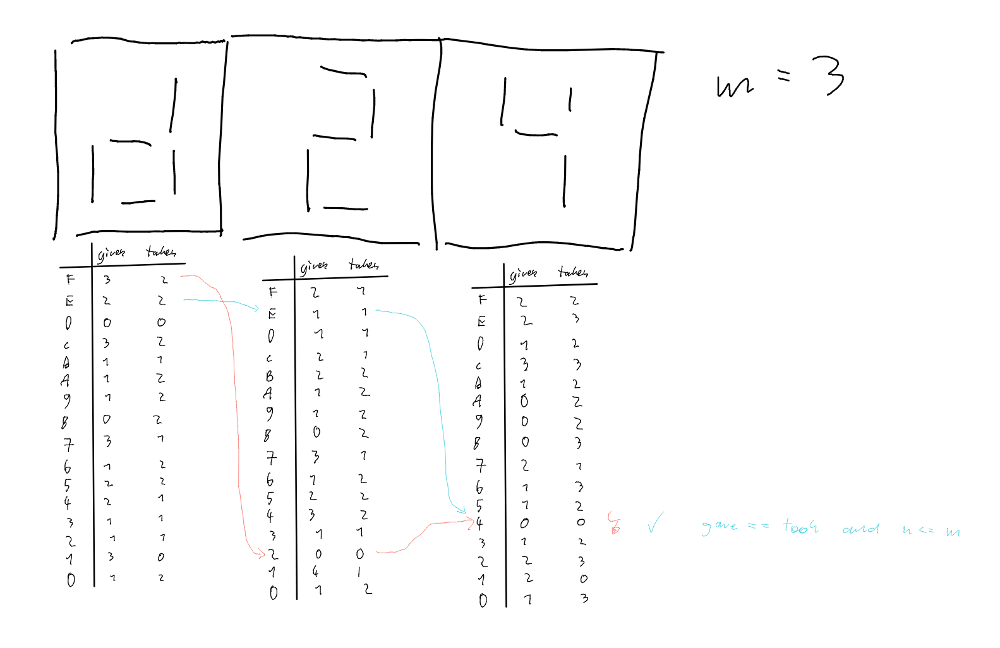

# Hex-Max

❔ A3 👤 61015 🧑 Leonhard Masche 📆 13.04.2022

## Inhaltsverzeichnis

1. [Lösungsidee](#lösungsidee)
    1. [Verbesserungen](#verbesserungen)
    2. [Aufbau](#aufbau)
2. [Umsetzung](#umsetzung)
3. [Beispiele](#beispiele)
4. [Quellcode](#quellcode)


## Lösungsidee

Die Hauptidee ist, für jede Stelle der Zahl, alle 15+1 Möglichkeiten sie zu verändern anzuschauen, und dann einen Depth-First-Search Algorithmus darüber laufen zu lassen. Es wird immer mitgezählt, wieviele Segmente genommen/platziert werden, und nur Veränderungen, die das Maximum `m` nicht überschreiten kommen infrage. So können Pfade teilweise oft schon, ohne am Ende des Displays angekommen zu sein, übersprungen werden. Am Ende der Zahl/des Displays (`index == len(display`) angekommen wird gecheckt, ob die Zahl der genommenen und platzierten Stäbchen übereinstimmt, ansonsten wird eine weitere Möglichkeit zurückverfolgt.



### Verbesserungen

#### Recursion-Limit

Um den Fehler ``MaxRecursionDepth exceeded`` zu vermeiden, wurde der dfs-Algorithmus mit einer while Schleife und einem Iterator implementiert.

### Aufbau

segment.py

#### class Segment

> Klasse, die ein Segment einer 7-Segment-Anzeige repräsentiert

#### def Segment.\_\_init__(char: str)

> Initialisiert das Segment von einem Zeichen [0-9A-F]

#### def Segment.\_\_repr__()__

> Gibt das Segment in lesbarer Form aus

#### def Segment.\_\_eq__(other)

> Gibt als Wahrheitswert zurück, ob das Segment identisch zum Segment `other` ist

#### def Segment.ascii_art() -> List[str]

> Produziert ascii-art um das gegebene Segment auf 3x3 Zeichen anzuzeigen

#### def Segment.get_takes_gives(seg) -> Tuple[int, int]

> Gibt die Anzahl der Lampen, die "eingeschaltet"/"ausgeschaltet" werden müssen zurück

program.py

#### def get_max_swappable(segments: List[Segment], m: int) -> str

> Gibt die Maximalzahl mit `m` Umlegungen zurück

#### def _animate(from\_: List[Segment], to: List[Segment]) -> Generator[List[Segment], None, None]

> Animiert die Umlegungen vom Display `from_` zum Display `to`.

#### def _print_asciiart(display: List[Segment])

> Gibt das Display `display` als ascii-art in die Konsole aus

## Umsetzung

Das Programm ist in der Sprache Python umgesetzt. Der Aufgabenordner enthält neben dieser Dokumentation eine ausführbare Python-Datei `program.py`. Diese Datei ist mit einer Python-Umgebung ab der Version `3.6` ausführbar.

Wird das Programm gestartet, wird zuerst eine Eingabe in Form einer einstelligen Zahl erwartet, um ein bestimmtes Beispiel auszuwählen. *(Das heißt: `0` für Beispiel `hexmax0.txt`)*

Nun wird die Logik des Programms angewandt und die Ausgabe erscheint in der Kommandozeile.

## Beispiele

Hier wird das Programm auf die sechs Beispiele aus dem Git-Repo angewendet:

---

`hexmax0.txt`

```text
D24
3
```

Umlegungen

```text
  ╗╔═╗╔ ╗
╔═╣╔═╝╚═╣
╚═╝╚═╝  ╝

╔═╗╔═╗╔ ╗
╔═╗╔═╝╚═╣
╚═╝╚═╝  ╝

╔═╗╔═╗╔ ╗
╠═ ╔═╝╚═╣
╚═╝╚═╝  ╝

╔═╗╔═╗╔ ╗
╠═ ╠═ ╚═╣
╚═╝╚═╝  ╝
```

Ausgabe zu `hexmax0.txt`

```text
EE4
```

---

`hexmax1.txt`

```text
509C431B55
8
```

Umlegungen

```text
╔═╗╔═╗╔═╗╔═╗╔ ╗╔═╗  ╗╔  ╔═╗╔═╗
╚═╗║ ║╚═╣║  ╚═╣ ═╣  ║╠═╗╚═╗╚═╗
╚═╝╚═╝╚═╝╚═╝  ╝╚═╝  ╝╚═╝╚═╝╚═╝

╔═╗╔═╗╔═╗╔═╗╔ ╗╔═╗  ╗╔  ╔═╗╔═╗
╠═ ║ ║╚═╣║  ╚═╣ ═╣  ║╠═╗╚═╗╚═╗
╚═╝╚═╝╚═╝╚═╝  ╝╚═╝  ╝╚═╝╚═╝╚═╝

╔═╗╔═╗╔═╗╔═╗╔ ╗╔═╗  ╗╔  ╔═╗╔═╗
╠═ ╠═╣╚═╣║  ╚═╣ ═╣  ║╠═╗╚═╗╚═╗
╚  ╚═╝╚═╝╚═╝  ╝╚═╝  ╝╚═╝╚═╝╚═╝

╔═╗╔═╗╔═╗╔═╗╔ ╗╔═╗  ╗╔  ╔═╗╔═╗
╠═ ╠═╗╠═╣║  ╚═╣ ═╣  ║╠═╗╚═╗╚═╗
╚  ╚═╝╚═╝╚═╝  ╝╚═╝  ╝╚═╝╚═╝╚═╝

╔═╗╔═╗╔═╗╔═╗╔ ╗╔═╗  ╗╔  ╔═╗╔═╗
╠═ ╠═ ╠═╣╠═ ╚═╣ ═╣  ║╠═╗╚═╗╚═╗
╚  ╚═╝╚═╝╚═╝  ╝╚═╝  ╝╚═╝╚═╝╚═╝

╔═╗╔═╗╔═╗╔═╗╔═╗╔═╗  ╗╔  ╔═╗╔═╗
╠═ ╠═ ╠═╣╠═ ╚═╣ ═╣  ║╠═╗╚═╗╚═╗
╚  ╚  ╚═╝╚═╝  ╝╚═╝  ╝╚═╝╚═╝╚═╝

╔═╗╔═╗╔═╗╔═╗╔═╗╔═╗  ╗╔  ╔═╗╔═╗
╠═ ╠═ ╠═╗╠═ ╠═╣ ═╣  ║╠═╗╚═╗╚═╗
╚  ╚  ╚═╝╚═╝╚ ╝╚═╝  ╝╚═╝╚═╝╚═╝

╔═╗╔═╗╔═╗╔═╗╔═╗╔═╗  ╗╔  ╔═╗╔═╗
╠═ ╠═ ╠═ ╠═ ╠═╣╚═╣  ║╠═╗╚═╗╚═╗
╚  ╚  ╚═╝╚═╝╚ ╝╚═╝  ╝╚═╝╚═╝╚═╝

╔═╗╔═╗╔═╗╔═╗╔═╗╔═╗╔═╗╔  ╔═╗╔═╗
╠═ ╠═ ╠═ ╠═ ╠═╣╚═╣  ║╠═╗╚═╗╚═╗
╚  ╚  ╚  ╚═╝╚ ╝╚═╝  ╝╚═╝╚═╝╚═╝
```

Ausgabe zu `hexmax1.txt`

```text
FFFEA97B55
```

---

`hexmax2.txt`

```text
632B29B38F11849015A3BCAEE2CDA0BD496919F8
37
```

Umlegungen

```text
╔═╗╔═╗╔═╗╔  ╔═╗╔═╗╔  ╔═╗╔═╗╔═╗  ╗  ╗╔═╗╔ ╗╔═╗╔═╗  ╗╔═╗╔═╗╔═╗╔  ╔═╗╔═╗╔═╗╔═╗╔═╗╔═╗  ╗╔═╗╔═╗╔    ╗╔ ╗╔═╗╔═╗╔═╗  ╗╔═╗╔═╗╔═╗
╠═╗ ═╣╔═╝╠═╗╔═╝╚═╣╠═╗ ═╣╠═╣╠═   ║  ║╠═╣╚═╣╚═╣║ ║  ║╚═╗╠═╣ ═╣╠═╗║  ╠═╣╠═ ╠═ ╔═╝║  ╔═╣╠═╣║ ║╠═╗╔═╣╚═╣╚═╣╠═╗╚═╣  ║╚═╣╠═ ╠═╣
╚═╝╚═╝╚═╝╚═╝╚═╝╚═╝╚═╝╚═╝╚═╝╚    ╝  ╝╚═╝  ╝╚═╝╚═╝  ╝╚═╝╚ ╝╚═╝╚═╝╚═╝╚ ╝╚═╝╚═╝╚═╝╚═╝╚═╝╚ ╝╚═╝╚═╝╚═╝  ╝╚═╝╚═╝╚═╝  ╝╚═╝╚  ╚═╝

╔═╗╔═╗╔═╗╔  ╔═╗╔═╗╔  ╔═╗╔═╗╔═╗  ╗  ╗╔═╗╔ ╗╔═╗╔═╗  ╗╔═╗╔═╗╔═╗╔  ╔═╗╔═╗╔═╗╔═╗╔═╗╔═╗  ╗╔═╗╔═╗╔    ╗╔ ╗╔═╗╔═╗╔═╗  ╗╔═╗╔═╗╔═╗
╠═ ╔═╣╔═╝╠═╗╔═╝╚═╣╠═╗ ═╣╠═╣╠═   ║  ║╠═╣╚═╣╚═╣║ ║  ║╚═╗╠═╣ ═╣╠═╗║  ╠═╣╠═ ╠═ ╔═╝║  ╔═╣╠═╣║ ║╠═╗╔═╣╚═╣╚═╣╠═╗╚═╣  ║╚═╣╠═ ╠═╣
╚═╝╚═╝╚═╝╚═╝╚═╝╚═╝╚═╝╚═╝╚═╝╚    ╝  ╝╚═╝  ╝╚═╝╚═╝  ╝╚═╝╚ ╝╚═╝╚═╝╚═╝╚ ╝╚═╝╚═╝╚═╝╚═╝╚═╝╚ ╝╚═╝╚═╝╚═╝  ╝╚═╝╚═╝╚═╝  ╝╚═╝╚  ╚═╝

╔═╗╔═╗╔═╗╔  ╔═╗╔═╗╔  ╔═╗╔═╗╔═╗  ╗  ╗╔═╗╔ ╗╔═╗╔═╗  ╗╔═╗╔═╗╔═╗╔  ╔═╗╔═╗╔═╗╔═╗╔═╗╔═╗  ╗╔═╗╔═╗╔    ╗╔ ╗╔═╗╔═╗╔═╗  ╗╔═╗╔═╗╔═╗
╠═ ╠═╣╔═╝╠═╗╔═╝╚═╣╠═╗ ═╣╠═╣╠═   ║  ║╠═╣╚═╣╚═╣║ ║  ║╚═╗╠═╣ ═╣╠═╗║  ╠═╣╠═ ╠═ ╔═╝║  ╔═╣╠═╣║ ║╠═╗╔═╣╚═╣╚═╣╠═╗╚═╣  ║╚═╣╠═ ╠═╣
╚  ╚═╝╚═╝╚═╝╚═╝╚═╝╚═╝╚═╝╚═╝╚    ╝  ╝╚═╝  ╝╚═╝╚═╝  ╝╚═╝╚ ╝╚═╝╚═╝╚═╝╚ ╝╚═╝╚═╝╚═╝╚═╝╚═╝╚ ╝╚═╝╚═╝╚═╝  ╝╚═╝╚═╝╚═╝  ╝╚═╝╚  ╚═╝

╔═╗╔═╗╔═╗╔  ╔═╗╔═╗╔  ╔═╗╔═╗╔═╗  ╗  ╗╔═╗╔ ╗╔═╗╔═╗  ╗╔═╗╔═╗╔═╗╔  ╔═╗╔═╗╔═╗╔═╗╔═╗╔═╗  ╗╔═╗╔═╗╔    ╗╔ ╗╔═╗╔═╗╔═╗  ╗╔═╗╔═╗╔═╗
╠═ ╠═╗╠═╝╠═╗╔═╝╚═╣╠═╗ ═╣╠═╣╠═   ║  ║╠═╣╚═╣╚═╣║ ║  ║╚═╗╠═╣ ═╣╠═╗║  ╠═╣╠═ ╠═ ╔═╝║  ╔═╣╠═╣║ ║╠═╗╔═╣╚═╣╚═╣╠═╗╚═╣  ║╚═╣╠═ ╠═╣
╚  ╚═╝╚═╝╚═╝╚═╝╚═╝╚═╝╚═╝╚═╝╚    ╝  ╝╚═╝  ╝╚═╝╚═╝  ╝╚═╝╚ ╝╚═╝╚═╝╚═╝╚ ╝╚═╝╚═╝╚═╝╚═╝╚═╝╚ ╝╚═╝╚═╝╚═╝  ╝╚═╝╚═╝╚═╝  ╝╚═╝╚  ╚═╝

╔═╗╔═╗╔═╗╔═╗╔═╗╔═╗╔  ╔═╗╔═╗╔═╗  ╗  ╗╔═╗╔ ╗╔═╗╔═╗  ╗╔═╗╔═╗╔═╗╔  ╔═╗╔═╗╔═╗╔═╗╔═╗╔═╗  ╗╔═╗╔═╗╔    ╗╔ ╗╔═╗╔═╗╔═╗  ╗╔═╗╔═╗╔═╗
╠═ ╠═ ╠═╝╠═╗╔═╝╚═╣╠═╗ ═╣╠═╣╠═   ║  ║╠═╣╚═╣╚═╣║ ║  ║╚═╗╠═╣ ═╣╠═╗║  ╠═╣╠═ ╠═ ╔═╝║  ╔═╣╠═╣║ ║╠═╗╔═╣╚═╣╚═╣╠═╗╚═╣  ║╚═╣╠═ ╠═╣
╚  ╚═╝╚═╝╚═╝╚═╝╚═╝╚═╝╚═╝╚═╝╚    ╝  ╝╚═╝  ╝╚═╝╚═╝  ╝╚═╝╚ ╝╚═╝╚═╝╚═╝╚ ╝╚═╝╚═╝╚═╝╚═╝╚═╝╚ ╝╚═╝╚═╝╚═╝  ╝╚═╝╚═╝╚═╝  ╝╚═╝╚  ╚═╝

╔═╗╔═╗╔═╗╔═╗╔═╗╔═╗╔  ╔═╗╔═╗╔═╗  ╗  ╗╔═╗╔ ╗╔═╗╔═╗  ╗╔═╗╔═╗╔═╗╔  ╔═╗╔═╗╔═╗╔═╗╔═╗╔═╗  ╗╔═╗╔═╗╔    ╗╔ ╗╔═╗╔═╗╔═╗  ╗╔═╗╔═╗╔═╗
╠═ ╠═ ╠═╝╠═╗╠═╝╚═╣╠═╗ ═╣╠═╣╠═   ║  ║╠═╣╚═╣╚═╣║ ║  ║╚═╗╠═╣ ═╣╠═╗║  ╠═╣╠═ ╠═ ╔═╝║  ╔═╣╠═╣║ ║╠═╗╔═╣╚═╣╚═╣╠═╗╚═╣  ║╚═╣╠═ ╠═╣
╚  ╚  ╚═╝╚═╝╚═╝╚═╝╚═╝╚═╝╚═╝╚    ╝  ╝╚═╝  ╝╚═╝╚═╝  ╝╚═╝╚ ╝╚═╝╚═╝╚═╝╚ ╝╚═╝╚═╝╚═╝╚═╝╚═╝╚ ╝╚═╝╚═╝╚═╝  ╝╚═╝╚═╝╚═╝  ╝╚═╝╚  ╚═╝

╔═╗╔═╗╔═╗╔═╗╔═╗╔═╗╔  ╔═╗╔═╗╔═╗  ╗  ╗╔═╗╔ ╗╔═╗╔═╗  ╗╔═╗╔═╗╔═╗╔  ╔═╗╔═╗╔═╗╔═╗╔═╗╔═╗  ╗╔═╗╔═╗╔    ╗╔ ╗╔═╗╔═╗╔═╗  ╗╔═╗╔═╗╔═╗
╠═ ╠═ ╠═ ╠═╗╠═╝╠═╣╠═╗ ═╣╠═╣╠═   ║  ║╠═╣╚═╣╚═╣║ ║  ║╚═╗╠═╣ ═╣╠═╗║  ╠═╣╠═ ╠═ ╔═╝║  ╔═╣╠═╣║ ║╠═╗╔═╣╚═╣╚═╣╠═╗╚═╣  ║╚═╣╠═ ╠═╣
╚  ╚  ╚═╝╚═╝╚═╝╚═╝╚═╝╚═╝╚═╝╚    ╝  ╝╚═╝  ╝╚═╝╚═╝  ╝╚═╝╚ ╝╚═╝╚═╝╚═╝╚ ╝╚═╝╚═╝╚═╝╚═╝╚═╝╚ ╝╚═╝╚═╝╚═╝  ╝╚═╝╚═╝╚═╝  ╝╚═╝╚  ╚═╝

╔═╗╔═╗╔═╗╔═╗╔═╗╔═╗╔═╗╔═╗╔═╗╔═╗  ╗  ╗╔═╗╔ ╗╔═╗╔═╗  ╗╔═╗╔═╗╔═╗╔  ╔═╗╔═╗╔═╗╔═╗╔═╗╔═╗  ╗╔═╗╔═╗╔    ╗╔ ╗╔═╗╔═╗╔═╗  ╗╔═╗╔═╗╔═╗
╠═ ╠═ ╠═ ╠═╗╠═╝╠═╣╠═╗ ═╣╠═╣╠═   ║  ║╠═╣╚═╣╚═╣║ ║  ║╚═╗╠═╣ ═╣╠═╗║  ╠═╣╠═ ╠═ ╔═╝║  ╔═╣╠═╣║ ║╠═╗╔═╣╚═╣╚═╣╠═╗╚═╣  ║╚═╣╠═ ╠═╣
╚  ╚  ╚  ╚═╝╚═╝╚═╝╚═╝╚═╝╚═╝╚    ╝  ╝╚═╝  ╝╚═╝╚═╝  ╝╚═╝╚ ╝╚═╝╚═╝╚═╝╚ ╝╚═╝╚═╝╚═╝╚═╝╚═╝╚ ╝╚═╝╚═╝╚═╝  ╝╚═╝╚═╝╚═╝  ╝╚═╝╚  ╚═╝

╔═╗╔═╗╔═╗╔═╗╔═╗╔═╗╔═╗╔═╗╔═╗╔═╗  ╗  ╗╔═╗╔ ╗╔═╗╔═╗  ╗╔═╗╔═╗╔═╗╔  ╔═╗╔═╗╔═╗╔═╗╔═╗╔═╗  ╗╔═╗╔═╗╔    ╗╔ ╗╔═╗╔═╗╔═╗  ╗╔═╗╔═╗╔═╗
╠═ ╠═ ╠═ ╠═ ╠═╝╠═╣╠═╗╔═╣╠═╣╠═   ║  ║╠═╣╚═╣╚═╣║ ║  ║╚═╗╠═╣ ═╣╠═╗║  ╠═╣╠═ ╠═ ╔═╝║  ╔═╣╠═╣║ ║╠═╗╔═╣╚═╣╚═╣╠═╗╚═╣  ║╚═╣╠═ ╠═╣
╚  ╚  ╚  ╚═╝╚═╝╚═╝╚═╝╚═╝╚═╝╚    ╝  ╝╚═╝  ╝╚═╝╚═╝  ╝╚═╝╚ ╝╚═╝╚═╝╚═╝╚ ╝╚═╝╚═╝╚═╝╚═╝╚═╝╚ ╝╚═╝╚═╝╚═╝  ╝╚═╝╚═╝╚═╝  ╝╚═╝╚  ╚═╝

╔═╗╔═╗╔═╗╔═╗╔═╗╔═╗╔═╗╔═╗╔═╗╔═╗  ╗  ╗╔═╗╔ ╗╔═╗╔═╗  ╗╔═╗╔═╗╔═╗╔  ╔═╗╔═╗╔═╗╔═╗╔═╗╔═╗  ╗╔═╗╔═╗╔    ╗╔ ╗╔═╗╔═╗╔═╗  ╗╔═╗╔═╗╔═╗
╠═ ╠═ ╠═ ╠═ ╠═╝╠═╣╠═╗╠═╣╠═╣╠═   ║  ║╠═╣╚═╣╚═╣║ ║  ║╚═╗╠═╣ ═╣╠═╗║  ╠═╣╠═ ╠═ ╔═╝║  ╔═╣╠═╣║ ║╠═╗╔═╣╚═╣╚═╣╠═╗╚═╣  ║╚═╣╠═ ╠═╣
╚  ╚  ╚  ╚  ╚═╝╚═╝╚═╝╚═╝╚═╝╚    ╝  ╝╚═╝  ╝╚═╝╚═╝  ╝╚═╝╚ ╝╚═╝╚═╝╚═╝╚ ╝╚═╝╚═╝╚═╝╚═╝╚═╝╚ ╝╚═╝╚═╝╚═╝  ╝╚═╝╚═╝╚═╝  ╝╚═╝╚  ╚═╝

╔═╗╔═╗╔═╗╔═╗╔═╗╔═╗╔═╗╔═╗╔═╗╔═╗╔═╗  ╗╔═╗╔ ╗╔═╗╔═╗  ╗╔═╗╔═╗╔═╗╔  ╔═╗╔═╗╔═╗╔═╗╔═╗╔═╗  ╗╔═╗╔═╗╔    ╗╔ ╗╔═╗╔═╗╔═╗  ╗╔═╗╔═╗╔═╗
╠═ ╠═ ╠═ ╠═ ╠═ ╠═╣╠═╗╠═╣╠═╣╠═   ║  ║╠═╣╚═╣╚═╣║ ║  ║╚═╗╠═╣ ═╣╠═╗║  ╠═╣╠═ ╠═ ╔═╝║  ╔═╣╠═╣║ ║╠═╗╔═╣╚═╣╚═╣╠═╗╚═╣  ║╚═╣╠═ ╠═╣
╚  ╚  ╚  ╚  ╚═╝╚═╝╚═╝╚═╝╚═╝╚    ╝  ╝╚═╝  ╝╚═╝╚═╝  ╝╚═╝╚ ╝╚═╝╚═╝╚═╝╚ ╝╚═╝╚═╝╚═╝╚═╝╚═╝╚ ╝╚═╝╚═╝╚═╝  ╝╚═╝╚═╝╚═╝  ╝╚═╝╚  ╚═╝

╔═╗╔═╗╔═╗╔═╗╔═╗╔═╗╔═╗╔═╗╔═╗╔═╗╔═╗  ╗╔═╗╔ ╗╔═╗╔═╗  ╗╔═╗╔═╗╔═╗╔  ╔═╗╔═╗╔═╗╔═╗╔═╗╔═╗  ╗╔═╗╔═╗╔    ╗╔ ╗╔═╗╔═╗╔═╗  ╗╔═╗╔═╗╔═╗
╠═ ╠═ ╠═ ╠═ ╠═ ╠═╣╠═╗╠═╣╠═╣╠═ ╔ ║  ║╠═╣╚═╣╚═╣║ ║  ║╚═╗╠═╣ ═╣╠═╗║  ╠═╣╠═ ╠═ ╔═╝║  ╔═╣╠═╣║ ║╠═╗╔═╣╚═╣╚═╣╠═╗╚═╣  ║╚═╣╠═ ╠═╣
╚  ╚  ╚  ╚  ╚  ╚═╝╚═╝╚═╝╚═╝╚  ╚ ╝  ╝╚═╝  ╝╚═╝╚═╝  ╝╚═╝╚ ╝╚═╝╚═╝╚═╝╚ ╝╚═╝╚═╝╚═╝╚═╝╚═╝╚ ╝╚═╝╚═╝╚═╝  ╝╚═╝╚═╝╚═╝  ╝╚═╝╚  ╚═╝

╔═╗╔═╗╔═╗╔═╗╔═╗╔═╗╔═╗╔═╗╔═╗╔═╗╔═╗  ╗╔═╗╔ ╗╔═╗╔═╗  ╗╔═╗╔═╗╔═╗╔  ╔═╗╔═╗╔═╗╔═╗╔═╗╔═╗  ╗╔═╗╔═╗╔    ╗╔ ╗╔═╗╔═╗╔═╗  ╗╔═╗╔═╗╔═╗
╠═ ╠═ ╠═ ╠═ ╠═ ╠═╗╠═╗╠═╣╠═╣╠═ ╔═╣  ║╠═╣╚═╣╚═╣║ ║  ║╚═╗╠═╣ ═╣╠═╗║  ╠═╣╠═ ╠═ ╔═╝║  ╔═╣╠═╣║ ║╠═╗╔═╣╚═╣╚═╣╠═╗╚═╣  ║╚═╣╠═ ╠═╣
╚  ╚  ╚  ╚  ╚  ╚═╝╚═╝╚═╝╚═╝╚  ╚ ╝  ╝╚═╝  ╝╚═╝╚═╝  ╝╚═╝╚ ╝╚═╝╚═╝╚═╝╚ ╝╚═╝╚═╝╚═╝╚═╝╚═╝╚ ╝╚═╝╚═╝╚═╝  ╝╚═╝╚═╝╚═╝  ╝╚═╝╚  ╚═╝

╔═╗╔═╗╔═╗╔═╗╔═╗╔═╗╔═╗╔═╗╔═╗╔═╗╔═╗  ╗╔═╗╔ ╗╔═╗╔═╗  ╗╔═╗╔═╗╔═╗╔  ╔═╗╔═╗╔═╗╔═╗╔═╗╔═╗  ╗╔═╗╔═╗╔    ╗╔ ╗╔═╗╔═╗╔═╗  ╗╔═╗╔═╗╔═╗
╠═ ╠═ ╠═ ╠═ ╠═ ╠═ ╠═╗╠═╣╠═╣╠═ ╠═╣  ║╠═╣╚═╣╚═╣║ ║  ║╚═╗╠═╣ ═╣╠═╗║  ╠═╣╠═ ╠═ ╔═╝║  ╔═╣╠═╣║ ║╠═╗╔═╣╚═╣╚═╣╠═╗╚═╣  ║╚═╣╠═ ╠═╣
╚  ╚  ╚  ╚  ╚  ╚═╝╚═╝╚═╝╚═╝╚  ╚ ╝  ╝╚═╝  ╝╚═╝╚═╝  ╝╚═╝╚ ╝╚═╝╚═╝╚═╝╚ ╝╚═╝╚═╝╚═╝╚═╝╚═╝╚ ╝╚═╝╚═╝╚═╝  ╝╚═╝╚═╝╚═╝  ╝╚═╝╚  ╚═╝

╔═╗╔═╗╔═╗╔═╗╔═╗╔═╗╔═╗╔═╗╔═╗╔═╗╔═╗╔═╗╔═╗╔ ╗╔═╗╔═╗  ╗╔═╗╔═╗╔═╗╔  ╔═╗╔═╗╔═╗╔═╗╔═╗╔═╗  ╗╔═╗╔═╗╔    ╗╔ ╗╔═╗╔═╗╔═╗  ╗╔═╗╔═╗╔═╗
╠═ ╠═ ╠═ ╠═ ╠═ ╠═ ╠═╗╠═╣╠═╣╠═ ╠═╣  ║╠═╣╚═╣╚═╣║ ║  ║╚═╗╠═╣ ═╣╠═╗║  ╠═╣╠═ ╠═ ╔═╝║  ╔═╣╠═╣║ ║╠═╗╔═╣╚═╣╚═╣╠═╗╚═╣  ║╚═╣╠═ ╠═╣
╚  ╚  ╚  ╚  ╚  ╚  ╚═╝╚═╝╚═╝╚  ╚ ╝  ╝╚═╝  ╝╚═╝╚═╝  ╝╚═╝╚ ╝╚═╝╚═╝╚═╝╚ ╝╚═╝╚═╝╚═╝╚═╝╚═╝╚ ╝╚═╝╚═╝╚═╝  ╝╚═╝╚═╝╚═╝  ╝╚═╝╚  ╚═╝

╔═╗╔═╗╔═╗╔═╗╔═╗╔═╗╔═╗╔═╗╔═╗╔═╗╔═╗╔═╗╔═╗╔ ╗╔═╗╔═╗  ╗╔═╗╔═╗╔═╗╔  ╔═╗╔═╗╔═╗╔═╗╔═╗╔═╗  ╗╔═╗╔═╗╔    ╗╔ ╗╔═╗╔═╗╔═╗  ╗╔═╗╔═╗╔═╗
╠═ ╠═ ╠═ ╠═ ╠═ ╠═ ╠═ ╠═╣╠═╣╠═ ╠═╣╔ ║╠═╣╚═╣╚═╣║ ║  ║╚═╗╠═╣ ═╣╠═╗║  ╠═╣╠═ ╠═ ╔═╝║  ╔═╣╠═╣║ ║╠═╗╔═╣╚═╣╚═╣╠═╗╚═╣  ║╚═╣╠═ ╠═╣
╚  ╚  ╚  ╚  ╚  ╚  ╚═╝╚═╝╚═╝╚  ╚ ╝╚ ╝╚═╝  ╝╚═╝╚═╝  ╝╚═╝╚ ╝╚═╝╚═╝╚═╝╚ ╝╚═╝╚═╝╚═╝╚═╝╚═╝╚ ╝╚═╝╚═╝╚═╝  ╝╚═╝╚═╝╚═╝  ╝╚═╝╚  ╚═╝

╔═╗╔═╗╔═╗╔═╗╔═╗╔═╗╔═╗╔═╗╔═╗╔═╗╔═╗╔═╗╔═╗╔ ╗╔═╗╔═╗  ╗╔═╗╔═╗╔═╗╔  ╔═╗╔═╗╔═╗╔═╗╔═╗╔═╗  ╗╔═╗╔═╗╔    ╗╔ ╗╔═╗╔═╗╔═╗  ╗╔═╗╔═╗╔═╗
╠═ ╠═ ╠═ ╠═ ╠═ ╠═ ╠═ ╠═╣╠═╣╠═ ╠═╣╔═╣╠═╣╚═╣╚═╣║ ║  ║╚═╗╠═╣ ═╣╠═╗║  ╠═╣╠═ ╠═ ╔═╝║  ╔═╣╠═╣║ ║╠═╗╔═╣╚═╣╚═╣╠═╗╚═╣  ║╚═╣╠═ ╠═╣
╚  ╚  ╚  ╚  ╚  ╚  ╚  ╚═╝╚═╝╚  ╚ ╝╚ ╝╚═╝  ╝╚═╝╚═╝  ╝╚═╝╚ ╝╚═╝╚═╝╚═╝╚ ╝╚═╝╚═╝╚═╝╚═╝╚═╝╚ ╝╚═╝╚═╝╚═╝  ╝╚═╝╚═╝╚═╝  ╝╚═╝╚  ╚═╝

╔═╗╔═╗╔═╗╔═╗╔═╗╔═╗╔═╗╔═╗╔═╗╔═╗╔═╗╔═╗╔═╗╔ ╗╔═╗╔═╗  ╗╔═╗╔═╗╔═╗╔  ╔═╗╔═╗╔═╗╔═╗╔═╗╔═╗  ╗╔═╗╔═╗╔    ╗╔ ╗╔═╗╔═╗╔═╗  ╗╔═╗╔═╗╔═╗
╠═ ╠═ ╠═ ╠═ ╠═ ╠═ ╠═ ╠═╗╠═╣╠═ ╠═╣╠═╣╠═╣╚═╣╚═╣║ ║  ║╚═╗╠═╣ ═╣╠═╗║  ╠═╣╠═ ╠═ ╔═╝║  ╔═╣╠═╣║ ║╠═╗╔═╣╚═╣╚═╣╠═╗╚═╣  ║╚═╣╠═ ╠═╣
╚  ╚  ╚  ╚  ╚  ╚  ╚  ╚═╝╚═╝╚  ╚ ╝╚ ╝╚═╝  ╝╚═╝╚═╝  ╝╚═╝╚ ╝╚═╝╚═╝╚═╝╚ ╝╚═╝╚═╝╚═╝╚═╝╚═╝╚ ╝╚═╝╚═╝╚═╝  ╝╚═╝╚═╝╚═╝  ╝╚═╝╚  ╚═╝

╔═╗╔═╗╔═╗╔═╗╔═╗╔═╗╔═╗╔═╗╔═╗╔═╗╔═╗╔═╗╔═╗╔═╗╔═╗╔═╗  ╗╔═╗╔═╗╔═╗╔  ╔═╗╔═╗╔═╗╔═╗╔═╗╔═╗  ╗╔═╗╔═╗╔    ╗╔ ╗╔═╗╔═╗╔═╗  ╗╔═╗╔═╗╔═╗
╠═ ╠═ ╠═ ╠═ ╠═ ╠═ ╠═ ╠═ ╠═╣╠═ ╠═╣╠═╣╠═╣╚═╣╚═╣║ ║  ║╚═╗╠═╣ ═╣╠═╗║  ╠═╣╠═ ╠═ ╔═╝║  ╔═╣╠═╣║ ║╠═╗╔═╣╚═╣╚═╣╠═╗╚═╣  ║╚═╣╠═ ╠═╣
╚  ╚  ╚  ╚  ╚  ╚  ╚  ╚═╝╚═╝╚  ╚ ╝╚ ╝╚═╝  ╝╚═╝╚═╝  ╝╚═╝╚ ╝╚═╝╚═╝╚═╝╚ ╝╚═╝╚═╝╚═╝╚═╝╚═╝╚ ╝╚═╝╚═╝╚═╝  ╝╚═╝╚═╝╚═╝  ╝╚═╝╚  ╚═╝

╔═╗╔═╗╔═╗╔═╗╔═╗╔═╗╔═╗╔═╗╔═╗╔═╗╔═╗╔═╗╔═╗╔═╗╔═╗╔═╗  ╗╔═╗╔═╗╔═╗╔  ╔═╗╔═╗╔═╗╔═╗╔═╗╔═╗  ╗╔═╗╔═╗╔    ╗╔ ╗╔═╗╔═╗╔═╗  ╗╔═╗╔═╗╔═╗
╠═ ╠═ ╠═ ╠═ ╠═ ╠═ ╠═ ╠═ ╠═╣╠═ ╠═╣╠═╣╠═╣╠═╣╚═╣║ ║  ║╚═╗╠═╣ ═╣╠═╗║  ╠═╣╠═ ╠═ ╔═╝║  ╔═╣╠═╣║ ║╠═╗╔═╣╚═╣╚═╣╠═╗╚═╣  ║╚═╣╠═ ╠═╣
╚  ╚  ╚  ╚  ╚  ╚  ╚  ╚  ╚═╝╚  ╚ ╝╚ ╝╚═╝╚ ╝╚═╝╚═╝  ╝╚═╝╚ ╝╚═╝╚═╝╚═╝╚ ╝╚═╝╚═╝╚═╝╚═╝╚═╝╚ ╝╚═╝╚═╝╚═╝  ╝╚═╝╚═╝╚═╝  ╝╚═╝╚  ╚═╝

╔═╗╔═╗╔═╗╔═╗╔═╗╔═╗╔═╗╔═╗╔═╗╔═╗╔═╗╔═╗╔═╗╔═╗╔═╗╔═╗  ╗╔═╗╔═╗╔═╗╔  ╔═╗╔═╗╔═╗╔═╗╔═╗╔═╗  ╗╔═╗╔═╗╔    ╗╔ ╗╔═╗╔═╗╔═╗  ╗╔═╗╔═╗╔═╗
╠═ ╠═ ╠═ ╠═ ╠═ ╠═ ╠═ ╠═ ╠═╗╠═ ╠═╣╠═╣╠═╣╠═╣╠═╣║ ║  ║╚═╗╠═╣ ═╣╠═╗║  ╠═╣╠═ ╠═ ╔═╝║  ╔═╣╠═╣║ ║╠═╗╔═╣╚═╣╚═╣╠═╗╚═╣  ║╚═╣╠═ ╠═╣
╚  ╚  ╚  ╚  ╚  ╚  ╚  ╚  ╚═╝╚  ╚ ╝╚ ╝╚═╝╚ ╝╚═╝╚═╝  ╝╚═╝╚ ╝╚═╝╚═╝╚═╝╚ ╝╚═╝╚═╝╚═╝╚═╝╚═╝╚ ╝╚═╝╚═╝╚═╝  ╝╚═╝╚═╝╚═╝  ╝╚═╝╚  ╚═╝

╔═╗╔═╗╔═╗╔═╗╔═╗╔═╗╔═╗╔═╗╔═╗╔═╗╔═╗╔═╗╔═╗╔═╗╔═╗╔═╗  ╗╔═╗╔═╗╔═╗╔  ╔═╗╔═╗╔═╗╔═╗╔═╗╔═╗  ╗╔═╗╔═╗╔    ╗╔ ╗╔═╗╔═╗╔═╗  ╗╔═╗╔═╗╔═╗
╠═ ╠═ ╠═ ╠═ ╠═ ╠═ ╠═ ╠═ ╠═ ╠═ ╠═╣╠═╣╠═╣╠═╣╠═╣╠═╣  ║╚═╗╠═╣ ═╣╠═╗║  ╠═╣╠═ ╠═ ╔═╝║  ╔═╣╠═╣║ ║╠═╗╔═╣╚═╣╚═╣╠═╗╚═╣  ║╚═╣╠═ ╠═╣
╚  ╚  ╚  ╚  ╚  ╚  ╚  ╚  ╚═╝╚  ╚ ╝╚ ╝╚═╝╚ ╝╚═╝╚═╝  ╝╚═╝╚ ╝╚═╝╚═╝╚═╝╚ ╝╚═╝╚═╝╚═╝╚═╝╚═╝╚ ╝╚═╝╚═╝╚═╝  ╝╚═╝╚═╝╚═╝  ╝╚═╝╚  ╚═╝

╔═╗╔═╗╔═╗╔═╗╔═╗╔═╗╔═╗╔═╗╔═╗╔═╗╔═╗╔═╗╔═╗╔═╗╔═╗╔═╗  ╗╔═╗╔═╗╔═╗╔  ╔═╗╔═╗╔═╗╔═╗╔═╗╔═╗  ╗╔═╗╔═╗╔    ╗╔ ╗╔═╗╔═╗╔═╗  ╗╔═╗╔═╗╔═╗
╠═ ╠═ ╠═ ╠═ ╠═ ╠═ ╠═ ╠═ ╠═ ╠═ ╠═╣╠═╣╠═╣╠═╣╠═╣╠═╣  ║╚═╗╠═╣ ═╣╠═╗║  ╠═╣╠═ ╠═ ╔═╝║  ╔═╣╠═╣║ ║╠═╗╔═╣╚═╣╚═╣╠═╗╚═╣  ║╚═╣╠═ ╠═╣
╚  ╚  ╚  ╚  ╚  ╚  ╚  ╚  ╚  ╚  ╚ ╝╚ ╝╚═╝╚ ╝╚═╝╚═╝╚═╝╚═╝╚ ╝╚═╝╚═╝╚═╝╚ ╝╚═╝╚═╝╚═╝╚═╝╚═╝╚ ╝╚═╝╚═╝╚═╝  ╝╚═╝╚═╝╚═╝  ╝╚═╝╚  ╚═╝

╔═╗╔═╗╔═╗╔═╗╔═╗╔═╗╔═╗╔═╗╔═╗╔═╗╔═╗╔═╗╔═╗╔═╗╔═╗╔═╗  ╗╔═╗╔═╗╔═╗╔  ╔═╗╔═╗╔═╗╔═╗╔═╗╔═╗  ╗╔═╗╔═╗╔    ╗╔ ╗╔═╗╔═╗╔═╗  ╗╔═╗╔═╗╔═╗
╠═ ╠═ ╠═ ╠═ ╠═ ╠═ ╠═ ╠═ ╠═ ╠═ ╠═╗╠═╣╠═╣╠═╣╠═╣╠═╣╔ ║╚═╗╠═╣ ═╣╠═╗║  ╠═╣╠═ ╠═ ╔═╝║  ╔═╣╠═╣║ ║╠═╗╔═╣╚═╣╚═╣╠═╗╚═╣  ║╚═╣╠═ ╠═╣
╚  ╚  ╚  ╚  ╚  ╚  ╚  ╚  ╚  ╚  ╚ ╝╚ ╝╚═╝╚ ╝╚═╝╚═╝╚═╝╚═╝╚ ╝╚═╝╚═╝╚═╝╚ ╝╚═╝╚═╝╚═╝╚═╝╚═╝╚ ╝╚═╝╚═╝╚═╝  ╝╚═╝╚═╝╚═╝  ╝╚═╝╚  ╚═╝

╔═╗╔═╗╔═╗╔═╗╔═╗╔═╗╔═╗╔═╗╔═╗╔═╗╔═╗╔═╗╔═╗╔═╗╔═╗╔═╗  ╗╔═╗╔═╗╔═╗╔  ╔═╗╔═╗╔═╗╔═╗╔═╗╔═╗  ╗╔═╗╔═╗╔    ╗╔ ╗╔═╗╔═╗╔═╗  ╗╔═╗╔═╗╔═╗
╠═ ╠═ ╠═ ╠═ ╠═ ╠═ ╠═ ╠═ ╠═ ╠═ ╠═ ╠═╣╠═╣╠═╣╠═╣╠═╣╔═╣╚═╗╠═╣ ═╣╠═╗║  ╠═╣╠═ ╠═ ╔═╝║  ╔═╣╠═╣║ ║╠═╗╔═╣╚═╣╚═╣╠═╗╚═╣  ║╚═╣╠═ ╠═╣
╚  ╚  ╚  ╚  ╚  ╚  ╚  ╚  ╚  ╚  ╚  ╚ ╝╚═╝╚ ╝╚═╝╚═╝╚═╝╚═╝╚ ╝╚═╝╚═╝╚═╝╚ ╝╚═╝╚═╝╚═╝╚═╝╚═╝╚ ╝╚═╝╚═╝╚═╝  ╝╚═╝╚═╝╚═╝  ╝╚═╝╚  ╚═╝

╔═╗╔═╗╔═╗╔═╗╔═╗╔═╗╔═╗╔═╗╔═╗╔═╗╔═╗╔═╗╔═╗╔═╗╔═╗╔═╗  ╗╔═╗╔═╗╔═╗╔  ╔═╗╔═╗╔═╗╔═╗╔═╗╔═╗  ╗╔═╗╔═╗╔    ╗╔ ╗╔═╗╔═╗╔═╗  ╗╔═╗╔═╗╔═╗
╠═ ╠═ ╠═ ╠═ ╠═ ╠═ ╠═ ╠═ ╠═ ╠═ ╠═ ╠═╗╠═╣╠═╣╠═╣╠═╣╔═╣╚═╣╠═╣ ═╣╠═╗║  ╠═╣╠═ ╠═ ╔═╝║  ╔═╣╠═╣║ ║╠═╗╔═╣╚═╣╚═╣╠═╗╚═╣  ║╚═╣╠═ ╠═╣
╚  ╚  ╚  ╚  ╚  ╚  ╚  ╚  ╚  ╚  ╚  ╚ ╝╚═╝╚ ╝╚═╝╚═╝╚═╝╚═╝╚ ╝╚═╝╚═╝╚═╝╚ ╝╚═╝╚═╝╚═╝╚═╝╚═╝╚ ╝╚═╝╚═╝╚═╝  ╝╚═╝╚═╝╚═╝  ╝╚═╝╚  ╚═╝

╔═╗╔═╗╔═╗╔═╗╔═╗╔═╗╔═╗╔═╗╔═╗╔═╗╔═╗╔═╗╔═╗╔═╗╔═╗╔═╗  ╗╔═╗╔═╗╔═╗╔  ╔═╗╔═╗╔═╗╔═╗╔═╗╔═╗  ╗╔═╗╔═╗╔    ╗╔ ╗╔═╗╔═╗╔═╗  ╗╔═╗╔═╗╔═╗
╠═ ╠═ ╠═ ╠═ ╠═ ╠═ ╠═ ╠═ ╠═ ╠═ ╠═ ╠═ ╠═╣╠═╣╠═╣╠═╣╔═╣╚═╣╠═╣╚═╣╠═╗║  ╠═╣╠═ ╠═ ╔═╝║  ╔═╣╠═╣║ ║╠═╗╔═╣╚═╣╚═╣╠═╗╚═╣  ║╚═╣╠═ ╠═╣
╚  ╚  ╚  ╚  ╚  ╚  ╚  ╚  ╚  ╚  ╚  ╚  ╚═╝╚ ╝╚═╝╚═╝╚═╝╚═╝╚ ╝╚═╝╚═╝╚═╝╚ ╝╚═╝╚═╝╚═╝╚═╝╚═╝╚ ╝╚═╝╚═╝╚═╝  ╝╚═╝╚═╝╚═╝  ╝╚═╝╚  ╚═╝

╔═╗╔═╗╔═╗╔═╗╔═╗╔═╗╔═╗╔═╗╔═╗╔═╗╔═╗╔═╗╔═╗╔═╗╔═╗╔═╗  ╗╔═╗╔═╗╔═╗╔  ╔═╗╔═╗╔═╗╔═╗╔═╗╔═╗  ╗╔═╗╔═╗╔    ╗╔ ╗╔═╗╔═╗╔═╗  ╗╔═╗╔═╗╔═╗
╠═ ╠═ ╠═ ╠═ ╠═ ╠═ ╠═ ╠═ ╠═ ╠═ ╠═ ╠═ ╠═╗╠═╣╠═╣╠═╣╔═╣╚═╣╠═╣╚═╣╠═╗╠═ ╠═╣╠═ ╠═ ╔═╝║  ╔═╣╠═╣║ ║╠═╗╔═╣╚═╣╚═╣╠═╗╚═╣  ║╚═╣╠═ ╠═╣
╚  ╚  ╚  ╚  ╚  ╚  ╚  ╚  ╚  ╚  ╚  ╚  ╚═╝╚ ╝╚═╝╚═╝╚═╝╚═╝╚ ╝╚═╝╚═╝╚═╝╚ ╝╚═╝╚═╝╚═╝╚═╝╚═╝╚ ╝╚═╝╚═╝╚═╝  ╝╚═╝╚═╝╚═╝  ╝╚═╝╚  ╚═╝

╔═╗╔═╗╔═╗╔═╗╔═╗╔═╗╔═╗╔═╗╔═╗╔═╗╔═╗╔═╗╔═╗╔═╗╔═╗╔═╗  ╗╔═╗╔═╗╔═╗╔  ╔═╗╔═╗╔═╗╔═╗╔═╗╔═╗  ╗╔═╗╔═╗╔    ╗╔ ╗╔═╗╔═╗╔═╗  ╗╔═╗╔═╗╔═╗
╠═ ╠═ ╠═ ╠═ ╠═ ╠═ ╠═ ╠═ ╠═ ╠═ ╠═ ╠═ ╠═ ╠═╣╠═╣╠═╣╔═╣╚═╣╠═╣╚═╣╠═╗╠═ ╠═╣╠═ ╠═ ╔═╣║  ╔═╣╠═╣║ ║╠═╗╔═╣╚═╣╚═╣╠═╗╚═╣  ║╚═╣╠═ ╠═╣
╚  ╚  ╚  ╚  ╚  ╚  ╚  ╚  ╚  ╚  ╚  ╚  ╚═╝╚ ╝╚═╝╚═╝╚═╝╚═╝╚ ╝╚═╝╚═╝╚═╝╚ ╝╚═╝╚═╝╚═╝╚═╝╚═╝╚ ╝╚═╝╚═╝╚═╝  ╝╚═╝╚═╝╚═╝  ╝╚═╝╚  ╚═╝

╔═╗╔═╗╔═╗╔═╗╔═╗╔═╗╔═╗╔═╗╔═╗╔═╗╔═╗╔═╗╔═╗╔═╗╔═╗╔═╗  ╗╔═╗╔═╗╔═╗╔  ╔═╗╔═╗╔═╗╔═╗╔═╗╔═╗  ╗╔═╗╔═╗╔    ╗╔ ╗╔═╗╔═╗╔═╗  ╗╔═╗╔═╗╔═╗
╠═ ╠═ ╠═ ╠═ ╠═ ╠═ ╠═ ╠═ ╠═ ╠═ ╠═ ╠═ ╠═ ╠═╣╠═╣╠═╣╔═╣╚═╣╠═╣╚═╣╠═╗╠═ ╠═╣╠═ ╠═ ╠═╣║  ╔═╣╠═╣║ ║╠═╗╔═╣╚═╣╚═╣╠═╗╚═╣  ║╚═╣╠═ ╠═╣
╚  ╚  ╚  ╚  ╚  ╚  ╚  ╚  ╚  ╚  ╚  ╚  ╚  ╚ ╝╚═╝╚═╝╚═╝╚═╝╚ ╝╚═╝╚═╝╚═╝╚ ╝╚═╝╚═╝╚═╝╚═╝╚═╝╚ ╝╚═╝╚═╝╚═╝  ╝╚═╝╚═╝╚═╝  ╝╚═╝╚  ╚═╝

╔═╗╔═╗╔═╗╔═╗╔═╗╔═╗╔═╗╔═╗╔═╗╔═╗╔═╗╔═╗╔═╗╔═╗╔═╗╔═╗  ╗╔═╗╔═╗╔═╗╔  ╔═╗╔═╗╔═╗╔═╗╔═╗╔═╗  ╗╔═╗╔═╗╔    ╗╔ ╗╔═╗╔═╗╔═╗  ╗╔═╗╔═╗╔═╗
╠═ ╠═ ╠═ ╠═ ╠═ ╠═ ╠═ ╠═ ╠═ ╠═ ╠═ ╠═ ╠═ ╠═╗╠═╣╠═╣╔═╣╚═╣╠═╣╚═╣╠═╗╠═ ╠═╣╠═ ╠═ ╠═╣╠═ ╔═╣╠═╣║ ║╠═╗╔═╣╚═╣╚═╣╠═╗╚═╣  ║╚═╣╠═ ╠═╣
╚  ╚  ╚  ╚  ╚  ╚  ╚  ╚  ╚  ╚  ╚  ╚  ╚  ╚ ╝╚═╝╚═╝╚═╝╚═╝╚ ╝╚═╝╚═╝╚═╝╚ ╝╚═╝╚═╝╚═╝╚═╝╚═╝╚ ╝╚═╝╚═╝╚═╝  ╝╚═╝╚═╝╚═╝  ╝╚═╝╚  ╚═╝

╔═╗╔═╗╔═╗╔═╗╔═╗╔═╗╔═╗╔═╗╔═╗╔═╗╔═╗╔═╗╔═╗╔═╗╔═╗╔═╗  ╗╔═╗╔═╗╔═╗╔  ╔═╗╔═╗╔═╗╔═╗╔═╗╔═╗  ╗╔═╗╔═╗╔    ╗╔ ╗╔═╗╔═╗╔═╗  ╗╔═╗╔═╗╔═╗
╠═ ╠═ ╠═ ╠═ ╠═ ╠═ ╠═ ╠═ ╠═ ╠═ ╠═ ╠═ ╠═ ╠═ ╠═╣╠═╣╔═╣╚═╣╠═╣╚═╣╠═╗╠═ ╠═╣╠═ ╠═ ╠═╣╠═ ╔═╣╠═╣╠═╣╠═╗╔═╣╚═╣╚═╣╠═╗╚═╣  ║╚═╣╠═ ╠═╣
╚  ╚  ╚  ╚  ╚  ╚  ╚  ╚  ╚  ╚  ╚  ╚  ╚  ╚  ╚═╝╚═╝╚═╝╚═╝╚ ╝╚═╝╚═╝╚═╝╚ ╝╚═╝╚═╝╚═╝╚═╝╚═╝╚ ╝╚═╝╚═╝╚═╝  ╝╚═╝╚═╝╚═╝  ╝╚═╝╚  ╚═╝

╔═╗╔═╗╔═╗╔═╗╔═╗╔═╗╔═╗╔═╗╔═╗╔═╗╔═╗╔═╗╔═╗╔═╗╔═╗╔═╗  ╗╔═╗╔═╗╔═╗╔  ╔═╗╔═╗╔═╗╔═╗╔═╗╔═╗  ╗╔═╗╔═╗╔    ╗╔═╗╔═╗╔═╗╔═╗  ╗╔═╗╔═╗╔═╗
╠═ ╠═ ╠═ ╠═ ╠═ ╠═ ╠═ ╠═ ╠═ ╠═ ╠═ ╠═ ╠═ ╠═ ╠═╗╠═╣╔═╣╚═╣╠═╣╚═╣╠═╗╠═ ╠═╣╠═ ╠═ ╠═╣╠═ ╔═╣╠═╣╠═╣╠═╗╔═╣╚═╣╚═╣╠═╗╚═╣  ║╚═╣╠═ ╠═╣
╚  ╚  ╚  ╚  ╚  ╚  ╚  ╚  ╚  ╚  ╚  ╚  ╚  ╚  ╚═╝╚═╝╚═╝╚═╝╚ ╝╚═╝╚═╝╚═╝╚ ╝╚═╝╚═╝╚═╝╚═╝╚═╝╚ ╝╚═╝╚═╝╚═╝  ╝╚═╝╚═╝╚═╝  ╝╚═╝╚  ╚═╝

╔═╗╔═╗╔═╗╔═╗╔═╗╔═╗╔═╗╔═╗╔═╗╔═╗╔═╗╔═╗╔═╗╔═╗╔═╗╔═╗  ╗╔═╗╔═╗╔═╗╔  ╔═╗╔═╗╔═╗╔═╗╔═╗╔═╗  ╗╔═╗╔═╗╔    ╗╔═╗╔═╗╔═╗╔═╗  ╗╔═╗╔═╗╔═╗
╠═ ╠═ ╠═ ╠═ ╠═ ╠═ ╠═ ╠═ ╠═ ╠═ ╠═ ╠═ ╠═ ╠═ ╠═ ╠═╣╔═╣╚═╣╠═╣╚═╣╠═╗╠═ ╠═╣╠═ ╠═ ╠═╣╠═ ╔═╣╠═╣╠═╣╠═╗╔═╣╠═╣╚═╣╠═╗╚═╣  ║╚═╣╠═ ╠═╣
╚  ╚  ╚  ╚  ╚  ╚  ╚  ╚  ╚  ╚  ╚  ╚  ╚  ╚  ╚═╝╚═╝╚═╝╚═╝╚ ╝╚═╝╚═╝╚═╝╚ ╝╚═╝╚═╝╚═╝╚═╝╚═╝╚ ╝╚═╝╚═╝╚═╝╚ ╝╚═╝╚═╝╚═╝  ╝╚═╝╚  ╚═╝

╔═╗╔═╗╔═╗╔═╗╔═╗╔═╗╔═╗╔═╗╔═╗╔═╗╔═╗╔═╗╔═╗╔═╗╔═╗╔═╗  ╗╔═╗╔═╗╔═╗╔  ╔═╗╔═╗╔═╗╔═╗╔═╗╔═╗  ╗╔═╗╔═╗╔    ╗╔═╗╔═╗╔═╗╔═╗  ╗╔═╗╔═╗╔═╗
╠═ ╠═ ╠═ ╠═ ╠═ ╠═ ╠═ ╠═ ╠═ ╠═ ╠═ ╠═ ╠═ ╠═ ╠═ ╠═╣╔═╣╚═╣╠═╣╚═╣╠═╗╠═ ╠═╣╠═ ╠═ ╠═╣╠═ ╔═╣╠═╣╠═╣╠═╗╔═╣╠═╣╚═╣╠═╣╚═╣  ║╚═╣╠═ ╠═╣
╚  ╚  ╚  ╚  ╚  ╚  ╚  ╚  ╚  ╚  ╚  ╚  ╚  ╚  ╚  ╚═╝╚═╝╚═╝╚ ╝╚═╝╚═╝╚═╝╚ ╝╚═╝╚═╝╚═╝╚═╝╚═╝╚ ╝╚═╝╚═╝╚═╝╚ ╝╚═╝╚═╝╚═╝  ╝╚═╝╚  ╚═╝

╔═╗╔═╗╔═╗╔═╗╔═╗╔═╗╔═╗╔═╗╔═╗╔═╗╔═╗╔═╗╔═╗╔═╗╔═╗╔═╗  ╗╔═╗╔═╗╔═╗╔  ╔═╗╔═╗╔═╗╔═╗╔═╗╔═╗  ╗╔═╗╔═╗╔    ╗╔═╗╔═╗╔═╗╔═╗  ╗╔═╗╔═╗╔═╗
╠═ ╠═ ╠═ ╠═ ╠═ ╠═ ╠═ ╠═ ╠═ ╠═ ╠═ ╠═ ╠═ ╠═ ╠═ ╠═╗╔═╣╚═╣╠═╣╚═╣╠═╗╠═ ╠═╣╠═ ╠═ ╠═╣╠═ ╔═╣╠═╣╠═╣╠═╗╔═╣╠═╣╚═╣╠═╣╚═╣  ║╚═╣╠═ ╠═╣
╚  ╚  ╚  ╚  ╚  ╚  ╚  ╚  ╚  ╚  ╚  ╚  ╚  ╚  ╚  ╚═╝╚═╝╚═╝╚ ╝╚═╝╚═╝╚═╝╚ ╝╚═╝╚═╝╚═╝╚═╝╚═╝╚ ╝╚═╝╚═╝╚═╝╚ ╝╚═╝╚═╝╚═╝╚═╝╚═╝╚  ╚═╝

╔═╗╔═╗╔═╗╔═╗╔═╗╔═╗╔═╗╔═╗╔═╗╔═╗╔═╗╔═╗╔═╗╔═╗╔═╗╔═╗  ╗╔═╗╔═╗╔═╗╔  ╔═╗╔═╗╔═╗╔═╗╔═╗╔═╗  ╗╔═╗╔═╗╔    ╗╔═╗╔═╗╔═╗╔═╗  ╗╔═╗╔═╗╔═╗
╠═ ╠═ ╠═ ╠═ ╠═ ╠═ ╠═ ╠═ ╠═ ╠═ ╠═ ╠═ ╠═ ╠═ ╠═ ╠═ ╔═╣╚═╣╠═╣╚═╣╠═╗╠═ ╠═╣╠═ ╠═ ╠═╣╠═ ╔═╣╠═╣╠═╣╠═╗╔═╣╠═╣╚═╣╠═╣╚═╣╔ ║╚═╣╠═ ╠═╣
╚  ╚  ╚  ╚  ╚  ╚  ╚  ╚  ╚  ╚  ╚  ╚  ╚  ╚  ╚  ╚═╝╚═╝╚═╝╚ ╝╚═╝╚═╝╚═╝╚ ╝╚═╝╚═╝╚═╝╚═╝╚═╝╚ ╝╚═╝╚═╝╚═╝╚ ╝╚═╝╚═╝╚═╝╚═╝╚═╝╚  ╚═╝

╔═╗╔═╗╔═╗╔═╗╔═╗╔═╗╔═╗╔═╗╔═╗╔═╗╔═╗╔═╗╔═╗╔═╗╔═╗╔═╗  ╗╔═╗╔═╗╔═╗╔  ╔═╗╔═╗╔═╗╔═╗╔═╗╔═╗  ╗╔═╗╔═╗╔    ╗╔═╗╔═╗╔═╗╔═╗  ╗╔═╗╔═╗╔═╗
╠═ ╠═ ╠═ ╠═ ╠═ ╠═ ╠═ ╠═ ╠═ ╠═ ╠═ ╠═ ╠═ ╠═ ╠═ ╠═ ╔═╣╚═╣╠═╣╚═╣╠═╗╠═ ╠═╣╠═ ╠═ ╠═╣╠═ ╔═╣╠═╣╠═╣╠═╗╔═╣╠═╣╚═╣╠═╣╚═╣╔═╣╚═╣╠═ ╠═╣
╚  ╚  ╚  ╚  ╚  ╚  ╚  ╚  ╚  ╚  ╚  ╚  ╚  ╚  ╚  ╚  ╚═╝╚═╝╚ ╝╚═╝╚═╝╚═╝╚ ╝╚═╝╚═╝╚═╝╚═╝╚═╝╚ ╝╚═╝╚═╝╚═╝╚ ╝╚═╝╚═╝╚═╝╚═╝╚═╝╚  ╚═╝
```

Ausgabe zu `hexmax2.txt`

```text
FFFFFFFFFFFFFFFFD9A9BEAEE8EDA8BDA989D9F8
```

---

`hexmax3.txt`

```text
0E9F1DB46B1E2C081B059EAF198FD491F477CE1CD37EBFB65F8D765055757C6F4796BB8B3DF7FCAC606DD0627D6B48C17C09
121
```

Ausgabe zu `hexmax3.txt`

```text
FFFFFFFFFFFFFFFFFFFFFFFFFFFFFFFFFFFFFFFFFFFFFFFFFFFFFFFFFFFFFFFFAA98BB8B9DFAFEAE888DD888AD8BA8EA8888
```

---

`hexmax4.txt`

```text
1A02B6B50D7489D7708A678593036FA265F2925B21C28B4724DD822038E3B4804192322F230AB7AF7BDA0A61BA7D4AD8F888
87
```

Ausgabe zu `hexmax4.txt`

```text
FFFFFFFFFFFFFFFFFFFFFFFFFFFFFFFFFFFFFFEB8DE88BAA8ADD888898E9BA88AD98988F898AB7AF7BDA8A61BA7D4AD8F888
```

---

`hexmax5.txt`

```text
EF50AA77ECAD25F5E11A307B713EAAEC55215E7E640FD263FA...75092226E7D54DEB42E1BB2CA9661A882FB718E7AA53F1E606
1369
```

Ausgabe zu `hexmax5.txt`

```text
warning: this might take a while...

```

Der recursion-depth Fehler wurde zwar vermieden, es dauert aber immernoch sehr Lange, durch die Möglickeiten bei einem 1001 Charakter Display zu iterieren.

## Quellcode

segment.py

```python
from typing import Callable, Generator, List, Mapping, Tuple, Union


class Segment:
    """Class representing a segment of a 7-segment display."""

    def __init__(self, char: Union[str, Tuple[Union[int, bool]]]):
        """
        Initialise the segment with data.

        Parameters
        ----------
        data : str
            The data to initialise the segment with. Either a hex character [0-9A-F] or a tuple of 7 booleans.

        """
        self.panels = [0] * 7  # 7 panels, ``, ^|, v|, _, |v, --, |^
        self.char = char.upper()
        assert self.char in '0123456789ABCDEF', "Invalid character for hex display"
        if self.char not in '14BD':
            self.panels[0] = 1
        if self.char not in '56BCEF':
            self.panels[1] = 1
        if self.char not in '2CEF':
            self.panels[2] = 1
        if self.char not in '147AF':
            self.panels[3] = 1
        if self.char not in '134579':
            self.panels[4] = 1
        if self.char not in '017C':
            self.panels[5] = 1
        if self.char not in '1237D':
            self.panels[6] = 1

    def __repr__(self):
        return f'<Segment ({self.char if hasattr(self, "char") else self.panels })>'

    def __eq__(self, other):
        return self.panels == other.panels

    def ascii_art(self) -> List[str]:
        """
        Get an ascii art representation of this segment.

        Returns
        -------
        List[str]
            A 3x3 matrix of characters traversing every row from the top left to the bottom right.

            | 0 | 1 | 2 |\n
            | 3 | 4 | 5 |\n
            | 6 | 7 | 8 |\n

        """
        chars = [' '] * 9

        chars[1] = '═' if self.panels[0] else chars[1]
        chars[4] = '═' if self.panels[5] else chars[4]
        chars[7] = '═' if self.panels[3] else chars[7]

        chars[0] = '╔' if self.panels[0] or self.panels[6] else chars[0]
        chars[0] = '╔' if self.panels[0] and not self.panels[6] else chars[0]
        chars[0] = '╔' if chars[0].strip() and self.panels[1] else chars[0]

        chars[2] = '╗' if self.panels[0] or self.panels[1] else chars[2]
        chars[2] = '╗' if self.panels[0] and not self.panels[1] else chars[2]
        chars[2] = '╗' if chars[2].strip() and self.panels[6] else chars[2]

        chars[6] = '╚' if self.panels[3] or self.panels[4] else chars[6]
        chars[6] = '╚' if self.panels[3] and not self.panels[4] else chars[6]
        chars[6] = '╚' if chars[6].strip() and self.panels[2] else chars[6]

        chars[8] = '╝' if self.panels[2] or self.panels[3] else chars[8]
        chars[8] = '╝' if self.panels[3] and not self.panels[2] else chars[8]
        chars[8] = '╝' if chars[8].strip() and self.panels[4] else chars[8]

        chars[3] = '║' if self.panels[4] or self.panels[6] else chars[3]
        chars[3] = '╔' if self.panels[4] and (not self.panels[6]) else chars[3]
        chars[3] = '╚' if (not self.panels[4]) and self.panels[6] else chars[3]
        chars[3] = '╠' if self.panels[4] and self.panels[5] and self.panels[6] else chars[3]

        chars[5] = '║' if self.panels[1] or self.panels[2] else chars[5]
        chars[5] = '╝' if self.panels[1] and (not self.panels[2]) else chars[5]
        chars[5] = '╗' if (not self.panels[1]) and self.panels[2] else chars[5]
        chars[5] = '╣' if self.panels[1] and self.panels[5] and self.panels[2] else chars[5]

        return chars

    def get_takes_gives(self, seg) -> Tuple[int, int]:
            takes = sum(1 if self.panels[x] < seg.panels[x] else 0 for x in range(7))
            gives = sum(1 if self.panels[x] > seg.panels[x] else 0 for x in range(7))
            return takes, gives

```

program.py

```python
from os.path import dirname, join
from typing import Generator, List, Tuple

from segment import Segment

costmap: List[List[Tuple[int, int]]] = []


# create lookup O(1)
for x, from_ in enumerate('0123456789ABCDEF'):
    costmap.append([0]*16)
    for y, to in enumerate('FEDCBA9876543210'):
        costmap[x][y] = Segment(from_).get_takes_gives(Segment(to))


def get_max_swappable(segments: List[Segment], m: int) -> str:
    if len(segments) > 500:
        print('warning: this might take a while...')
    iterator = [0]*len(segments)
    result: List[str] = []  # list of char

    def step(index: int):
        for i in range(index, -1, -1):
            carry = False
            if iterator[i] == 15:
                carry = True
            iterator[i] = (iterator[i]+1) % 16
            if not carry:
                break

    while True:
        current_takes, current_gives = 0, 0
        result = []
        for i in range(len(segments)):
            takes, gives = costmap[int(segments[i].char, base=16)][iterator[i]]
            if (takes + current_takes > m) or (gives + current_gives > m):
                step(i)
                break
            current_takes += takes
            current_gives += gives
            result.append(hex(15-iterator[i])[2].upper())
            if i == len(segments)-1:
                if current_takes == current_gives:
                    return ''.join(result)
                else:
                    step(i)


def _animate(from_: str, to: str) -> Generator[List[Segment], None, None]:
    from_ = [Segment(char) for char in from_]
    to = [Segment(char) for char in to]
    while from_ != to:
        for i in range(7*len(to)):
            seg, i = i//7, i % 7
            if from_[seg].panels[i] and not to[seg].panels[i]:
                from_[seg].panels[i] = 0
                from_[seg].__dict__.pop('char', None)
                break
        else:
            raise ValueError('Not the same number of sticks!')
        for i in range(7*len(to)):
            seg, i = i//7, i % 7
            if not from_[seg].panels[i] and to[seg].panels[i]:
                from_[seg].panels[i] = 1
                from_[seg].__dict__.pop('char', None)
                break
        else:
            raise ValueError('Not the same number of sticks!')
        yield from_
    return


def _print_asciiart(display: List[Segment]):
    out = [[], [], []]
    for seg in display:
        asciiart = seg.ascii_art()
        for i in range(3):
            out[i] += asciiart[i*3:i*3+3]
    for line in out:
        print(''.join(line))


while True:
    choice = int(input("Bitte die Nummer des Beispiels eingeben [0-5]: "))
    with open(join(dirname(__file__), f'beispieldaten/hexmax{choice}.txt')) as f:
        display = [Segment(char) for char in f.readline().strip()]
        m = int(f.readline().strip())

    print(get_max_swappable(display, m))

```
